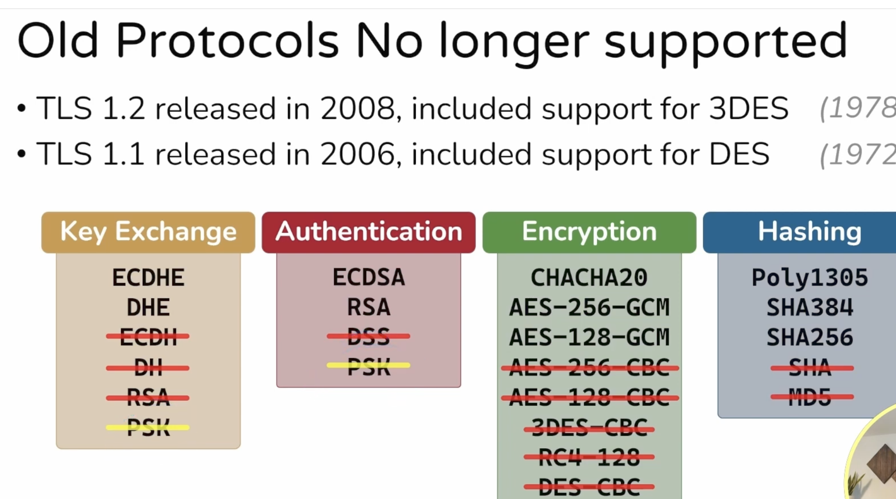
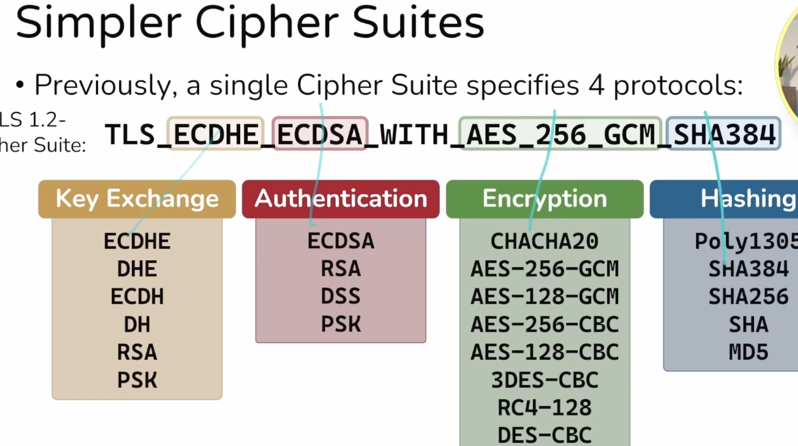
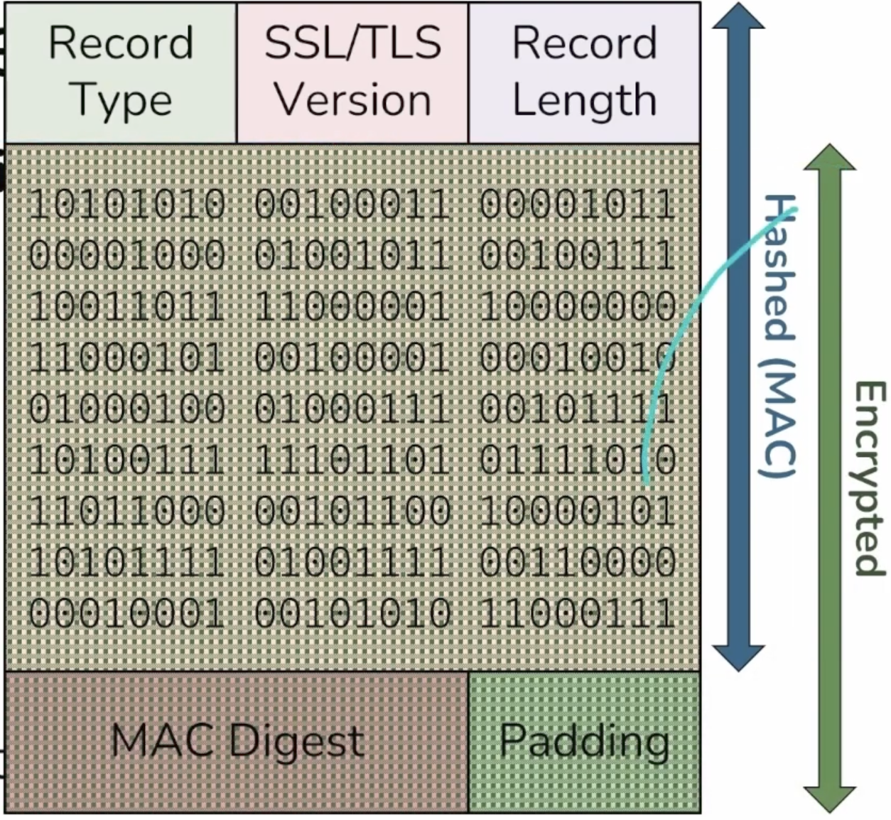

# openssl-practice-lab

## TLS

A cipher suite is a set of cryptographic primitives that work together to provide confidentiality, integrity, and authenticity. WireGuard uses a fixed set of primitives, chosen for their security and performance. The protocol does not negotiate different cipher suites; instead, it relies on the security of the chosen primitives to ensure that all communications are secure.

A Cipher suite typically includes:
- Key exchange algorithm (e.g., X25519)
- Encryption algorithm (e.g., ChaCha20)
- Message authentication code (MAC) algorithm (e.g., Poly1305)
- Hash function (e.g., BLAKE2s) 

- in TLS 1.3, insecure or weak cipher suites are not allowed


- it also simplifies what a cipher suite is


- This different combination led to over 300+ cipher suites in TLS 1.2 and prior, with about 270 considred insecure or weak. TLS 1.3 has only 5 cipher suites, all of which are considered secure.

- TLS 1.3 divides these functions into three "orthogonal" choices:
- Key exchange
- Encryption and hashing
- Message authentication

Here is a sample cipher suite in TLS 1.3:
- TLS_AES_128_GCM_SHA256
- Encryption: AES in Galois/Counter Mode (GCM) with a 128-bit key
- Hashing: SHA-256

- TLS_AES_256_GCM_SHA384
- Encryption: AES in Galois/Counter Mode (GCM) with a 256-bit key
- Hashing: SHA-384

Notice it only specifies a symmetric encryption algorithm and a hash function.We still need to do key exchange and message authentication, but those are handled separately in TLS 1.3. The choice of key for key exchange and message authentication is independent of the choice for encryption and hashing. That is what "orthogonal" means: the choice you use for one, doesn't affect the choice you use for the other. The benefit of this is that you no longer need to have a unique cipher suite that accounts for every unique combination of four security services. You only need a unique cipher suite for every combination of two security services: encryption and hashing. The other two services are handled separately, and can be mixed and matched with any cipher suite. The cipher suite 1s a combination of unique symmetric encryption and hashing algorithms.

- TLS_AES_128_GCM_SHA256 is a cipher suite that uses AES with a 128-bit key in Galois/Counter Mode (GCM) for encryption, and SHA-256 for hashing. 
- TLS_AES_256_GCM_SHA384 is a cipher suite that uses AES with a 256-bit key in Galois/Counter Mode (GCM) for encryption, and SHA-384 for hashing.
- TLS_CHACHA20_POLY1305_SHA256 is a cipher suite that uses the ChaCha20 stream cipher for encryption, and Poly1305 for message authentication, with SHA-256 for hashing.
- TLS_AES_128_CCM_SHA256 is a cipher suite that uses AES in Counter with CBC-MAC (CCM) mode for encryption, and SHA-256 for hashing.
- TLS_AES_128_CCM_8_SHA256 is a cipher suite that uses AES in Counter with CBC-MAC (CCM) mode for encryption, with an 8-byte authentication tag, and SHA-256 for hashing.

- The hash function is used for hmac-based key derivation function(HKDF) and for the handshake transcript hash. The handshake transcript hash is used to verify the integrity of the handshake messages and to derive the session keys. The HKDF is used to derive the session keys from the shared secret established during the key exchange.

- All TLS 1.3 cipher suites use AEAD (Authenticated Encryption with Associated Data) algorithms, which provide both confidentiality and integrity in a single operation. The AEAD algorithms used in TLS 1.3 are AES-GCM, AES-CCM, and ChaCha20-Poly1305.

- Authenticated means integrity provided
- Before AEAD, TLS and SSL first hashed the message, then encrypted it. This is called MAC-then-encrypt. The problem with this approach is that it is vulnerable to padding oracle attacks, where an attacker can modify the ciphertext and learn information about the plaintext by observing the server's response to the modified ciphertext. AEAD solves this problem by combining encryption and authentication in a single operation, so that any modification to the ciphertext will result in a failed authentication check.



- In all versions of TLS,the fundamental unit of data is a record. A record is a chunk of data that is processed as a single unit. Each record has a header that contains information about the record, such as its length and type. The 5-byte header is never encrypted, but the rest of the record is encrypted and authenticated. The header is used to determine how to process the record, and it is not considered part of the plaintext or ciphertext.

- With AEAD, a portion of the data is used as associated data, which is not encrypted but is authenticated. This means that any modification to the associated data will result in a failed authentication check
- The rest of the data is encrypted and authenticated, so that any modification to the ciphertext will also result in a failed authentication check. This provides both confidentiality and integrity for the data.

- IPSEC does encyrp-then-mac, which is better than mac-then-encrypt.An even better choice is AEAD, which means you don't have to consider which you are doing first or second. You just do both at once, and the algorithm takes care of the details.

There are two parts to AEAD: the authenticated encypption part and the associated data part. The authenticated encryption part provides confidentiality and integrity for the plaintext, while the associated data part provides integrity for the additional data that is not encrypted. The associated data can include things like headers, sequence numbers, and other metadata that needs to be authenticated but not encrypted.


`You cannot raise the overall security of the system past AES-256's native strength.`

## The Unencrypted Header
Regardless of the encryption method, every TLS packet starts with a 5-byte plaintext header:
- `Content Type (1 byte)`: E.g., Handshake (22), Alert (21), Application Data (23).
- `Version (2 bytes)`: E.g., 0x0303 for TLS 1.2.
- `Length (2 bytes)`: The size of the payload to follow.

### Legacy TLS 1.2: CBC Mode and MAC-then-Encrypt
Before AEAD became the standard, TLS 1.2 primarily relied on Block Ciphers (like AES-CBC) paired with a separate HMAC algorithm (like SHA-256). This used a flawed architecture called MAC-then-Encrypt.
- `Generate MAC`: The system calculates a Message Authentication Code (HMAC) over the plaintext payload and the unencrypted 5-byte header.
- `Append MAC`: This HMAC is appended to the plaintext payload.
- `Pad`: Because block ciphers require data to be in exact block sizes (e.g., 16 bytes for AES), padding is appended to the end.
- `Encrypt`: The Payload, MAC, and Padding are all encrypted together using the cipher.

The Flaw: When the receiver gets the packet, it has to decrypt the data before it can check the MAC to see if the packet was tampered with. If an attacker flipped a bit in transit, the decryption yields invalid padding. The server would reject the invalid padding before checking the MAC, leaking tiny timing differences that allowed attackers to completely decrypt the connection

```java
	/**
	 * Encrypts the specified plain text using AES/CBC/PKCS5Padding/
	 * HMAC-SHA2.
	 * 
	 * <p>See RFC 7518 (JWA), section 5.2.2.1
	 *
	 * <p>See draft-mcgrew-aead-aes-cbc-hmac-sha2-01
	 *
	 * @param secretKey   The secret key. Must be 256 or 512 bits long.
	 *                    Must not be {@code null}.
	 * @param iv          The initialisation vector (IV). Must not be
	 *                    {@code null}.
	 * @param plainText   The plain text. Must not be {@code null}.
	 * @param aad         The additional authenticated data. Must not be
	 *                    {@code null}.
	 * @param ceProvider  The JCA provider for the content encryption, or
	 *                    {@code null} to use the default one.
	 * @param macProvider The JCA provider for the MAC computation, or
	 *                    {@code null} to use the default one.
	 *
	 * @return The authenticated cipher text.
	 *
	 * @throws JOSEException If encryption failed.
	 */
	public static AuthenticatedCipherText encryptAuthenticated(final SecretKey secretKey,
								   final byte[] iv,
								   final byte[] plainText,
								   final byte[] aad,
								   final Provider ceProvider,
								   final Provider macProvider)
		throws JOSEException {

		// Extract MAC + AES/CBC keys from input secret key
		CompositeKey compositeKey = new CompositeKey(secretKey);

		// Encrypt plain text
		byte[] cipherText = encrypt(compositeKey.getAESKey(), iv, plainText, ceProvider);

		// AAD length to 8 byte array
		byte[] al = AAD.computeLength(aad);

		// Do MAC
		int hmacInputLength = aad.length + iv.length + cipherText.length + al.length;
		byte[] hmacInput = ByteBuffer.allocate(hmacInputLength).put(aad).put(iv).put(cipherText).put(al).array();
		byte[] hmac = HMAC.compute(compositeKey.getMACKey(), hmacInput, macProvider);
		byte[] authTag = Arrays.copyOf(hmac, compositeKey.getTruncatedMACByteLength());

		return new AuthenticatedCipherText(cipherText, authTag);
	}
```

```java
	/**
	 * Decrypts the specified cipher text using AES/CBC/PKCS5Padding/
	 * HMAC-SHA2.
	 * 
	 * <p>See RFC 7518 (JWA), section 5.2.2.2
	 *
	 * <p>See draft-mcgrew-aead-aes-cbc-hmac-sha2-01
	 *
	 * @param secretKey   The secret key. Must be 256 or 512 bits long.
	 *                    Must not be {@code null}.
	 * @param iv          The initialisation vector (IV). Must not be
	 *                    {@code null}.
	 * @param cipherText  The cipher text. Must not be {@code null}.
	 * @param aad         The additional authenticated data. Must not be
	 *                    {@code null}.
	 * @param authTag     The authentication tag. Must not be {@code null}.
	 * @param ceProvider  The JCA provider for the content encryption, or
	 *                    {@code null} to use the default one.
	 * @param macProvider The JCA provider for the MAC computation, or
	 *                    {@code null} to use the default one.
	 *
	 * @return The decrypted plain text.
	 *
	 * @throws JOSEException If decryption failed.
	 */
	public static byte[] decryptAuthenticated(final SecretKey secretKey,
		                                  final byte[] iv,
		                                  final byte[] cipherText,
		                                  final byte[] aad,
		                                  final byte[] authTag,
		                                  final Provider ceProvider,
						  final Provider macProvider)
		throws JOSEException {


		// Extract MAC + AES/CBC keys from input secret key
		CompositeKey compositeKey = new CompositeKey(secretKey);

		// AAD length to 8 byte array
		byte[] al = AAD.computeLength(aad);

		// Check MAC
		int hmacInputLength = aad.length + iv.length + cipherText.length + al.length;
		byte[] hmacInput = ByteBuffer.allocate(hmacInputLength).
			put(aad).
			put(iv).
			put(cipherText).
			put(al).
			array();
		byte[] hmac = HMAC.compute(compositeKey.getMACKey(), hmacInput, macProvider);

		byte[] expectedAuthTag = Arrays.copyOf(hmac, compositeKey.getTruncatedMACByteLength());

		if (! ConstantTimeUtils.areEqual(expectedAuthTag, authTag)) {
			throw new JOSEException("MAC check failed");
		}

		return decrypt(compositeKey.getAESKey(), iv, cipherText, ceProvider);
	}
```
Note the ordering — the tag check happens before decryption. If the AAD the receiver holds differs by even one byte from the AAD the sender used, the recomputed HMAC differs, and nothing gets decrypted.

```java
	/**
	 * Encrypts the specified plain text using AES/GCM/NoPadding.
	 *
	 * @param secretKey   The AES key. Must not be {@code null}.
	 * @param ivContainer The initialisation vector (IV). Must not be
	 *                    {@code null}. This is both input and output
	 *                    parameter. On input, it carries externally
	 *                    generated IV; on output, it carries the IV the
	 *                    cipher actually used. JCA/JCE providers may
	 *                    prefer to use an internally generated IV, e.g. as
	 *                    described in
	 *                    <a href="http://nvlpubs.nist.gov/nistpubs/Legacy/SP/nistspecialpublication800-38d.pdf">NIST
	 *                    Special Publication 800-38D </a>.
	 * @param plainText   The plain text. Must not be {@code null}.
	 * @param authData    The authenticated data. Must not be {@code null}.
	 * @param provider    The JCA provider to use, {@code null} implies the
	 *                    default.
	 *
	 * @return The authenticated cipher text.
	 *
	 * @throws JOSEException If encryption failed.
	 */
	public static AuthenticatedCipherText encrypt(final SecretKey secretKey,
						      final Container<byte[]> ivContainer,
						      final byte[] plainText,
						      final byte[] authData,
						      final Provider provider)
		throws JOSEException {

		// Key alg must be "AES"
		final SecretKey aesKey = KeyUtils.toAESKey(secretKey);
		
		Cipher cipher;

		byte[] iv = ivContainer.get();

		try {
			if (provider != null) {
				cipher = Cipher.getInstance("AES/GCM/NoPadding", provider);
			} else {
				cipher = Cipher.getInstance("AES/GCM/NoPadding");
			}

			GCMParameterSpec gcmSpec = new GCMParameterSpec(AUTH_TAG_BIT_LENGTH, iv);
			cipher.init(Cipher.ENCRYPT_MODE, aesKey, gcmSpec);

		} catch (NoSuchAlgorithmException | NoSuchPaddingException | InvalidKeyException | InvalidAlgorithmParameterException e) {
			throw new JOSEException("Couldn't create AES/GCM/NoPadding cipher: " + e.getMessage(), e);
		}

		cipher.updateAAD(authData);

		byte[] cipherOutput;
		try {
			cipherOutput = cipher.doFinal(plainText);
		} catch (IllegalBlockSizeException | BadPaddingException e) {
			throw new JOSEException("Couldn't encrypt with AES/GCM/NoPadding: " + e.getMessage(), e);
		}

		final int tagPos = cipherOutput.length - ByteUtils.byteLength(AUTH_TAG_BIT_LENGTH);

		byte[] cipherText = ByteUtils.subArray(cipherOutput, 0, tagPos);
		byte[] authTag = ByteUtils.subArray(cipherOutput, tagPos, ByteUtils.byteLength(AUTH_TAG_BIT_LENGTH));

		// retrieve the actual IV used by the cipher -- it may be internally-generated.
		ivContainer.set(actualIVOf(cipher));

		return new AuthenticatedCipherText(cipherText, authTag);
	}
```

```sh
cipher.updateAAD(authData);
cipherOutput = cipher.doFinal(plainText);
```

```java
/**
	 * Decrypts the specified cipher text using AES/GCM/NoPadding.
	 *
	 * @param secretKey  The AES key. Must not be {@code null}.
	 * @param iv         The initialisation vector (IV). Must not be
	 *                   {@code null}.
	 * @param cipherText The cipher text. Must not be {@code null}.
	 * @param authData   The authenticated data. Must not be {@code null}.
	 * @param authTag    The authentication tag. Must not be {@code null}.
	 * @param provider   The JCA provider to use, {@code null} implies the
	 *                   default.
	 *
	 * @return The decrypted plain text.
	 *
	 * @throws JOSEException If decryption failed.
	 */
	public static byte[] decrypt(final SecretKey secretKey, 
		                     final byte[] iv,
		                     final byte[] cipherText,
		                     final byte[] authData,
		                     final byte[] authTag,
		                     final Provider provider)
		throws JOSEException {
		
		// Key alg must be "AES"
		final SecretKey aesKey = KeyUtils.toAESKey(secretKey);
		
		Cipher cipher;
		try {
			if (provider != null) {
				cipher = Cipher.getInstance("AES/GCM/NoPadding", provider);
			} else {
				cipher = Cipher.getInstance("AES/GCM/NoPadding");
			}

			GCMParameterSpec gcmSpec = new GCMParameterSpec(AUTH_TAG_BIT_LENGTH, iv);
			cipher.init(Cipher.DECRYPT_MODE, aesKey, gcmSpec);

		} catch (NoSuchAlgorithmException | NoSuchPaddingException | InvalidKeyException | InvalidAlgorithmParameterException e) {
			throw new JOSEException("Couldn't create AES/GCM/NoPadding cipher: " + e.getMessage(), e);
		}

		cipher.updateAAD(authData);

		try {
			return cipher.doFinal(ByteUtils.concat(cipherText, authTag));
		} catch (IllegalBlockSizeException | BadPaddingException e) {
			throw new JOSEException("AES/GCM/NoPadding decryption failed: " + e.getMessage(), e);
		}
	}
```

`al` is the AAD's length in bits as a 64-bit big-endian value (AAD.java:69-70). It exists because `aad ‖ iv ‖ cipherText` is an ambiguous concatenation — AAD is variable-length and sits at the front. Without a length commitment, an attacker could shift the boundary: move trailing bytes out of the AAD and into the position where the IV is read, producing a different (AAD, IV, ciphertext) split that hashes to the identical buffer and therefore the identical tag. Appending the length makes the parse unique, so exactly one split can produce a given tag.

GCM does the equivalent in its final GHASH block, which encodes both the AAD bit length and the ciphertext bit length. Any construction that concatenates variable-length fields into a MAC needs this; it's the standard canonicalization defense

```sh
             ┌─────────── both feed the tag ───────────┐
   AAD ──────┤                                         │
   (clear)   │    tag = MAC(key, AAD, ciphertext)      │
   plaintext ┴─> ciphertext ───────────────────────────┘
              (encrypted)

   on the wire:   AAD | IV | ciphertext | tag
                   ↑                       ↑
              readable, but          breaks if either
              not modifiable          one is altered
```


Both modes here are encrypt-then-MAC: AESCBC.java:192 encrypts first, then MACs the result. That ordering is deliberate and not interchangeable — MAC-then-encrypt and encrypt-and-MAC both have known failure modes (padding oracles being the famous one for CBC). It's also why the decrypt path checks the tag before calling decrypt — you never run the cipher over unauthenticated bytes.

What else rides along in the tag input, beyond the two you asked about: the IV and the length fields. The full CBC-HMAC input is `aad ‖ iv ‖ cipherText ‖ al`. GCM folds the nonce in through its counter derivation and commits both lengths in the final GHASH block.

```java
byte[] al = AAD.computeLength(aad);
int hmacInputLength = aad.length + iv.length + cipherText.length + al.length;
byte[] hmacInput = ByteBuffer.allocate(hmacInputLength)
    .put(aad).put(iv).put(cipherText).put(al).array();
```

An unkeyed hash detects accidental corruption, not adversarial modification. The tag has to be something only a holder of the key can produce — that's a MAC.

`the tag is a fixed-size value that only a key-holder can produce, and it is a function of the AAD, the ciphertext, the nonce/IV, and an unambiguous encoding of their lengths.`

```java
public final class CompositeKey {


	/**
	 * The input key.
	 */
	private final SecretKey inputKey;


	/**
	 * The extracted MAC key.
	 */
	private final SecretKey macKey;


	/**
	 * The extracted AES key.
	 */
	private final SecretKey encKey;


	/**
	 * The expected truncated MAC output length.
	 */
	private final int truncatedMacLength;


	/**
	 * Creates a new composite key from the specified secret key.
	 *
	 * @param inputKey The input key. Must be 256, 384 or 512 bits long.
	 *                 Must not be {@code null}.
	 *
	 * @throws KeyLengthException If the input key length is not supported.
	 */
	public CompositeKey(final SecretKey inputKey)
		throws KeyLengthException {

		this.inputKey = inputKey;

		byte[] secretKeyBytes = inputKey.getEncoded();

		if (secretKeyBytes.length == 32) {

			// AES_128_CBC_HMAC_SHA_256
			// 256 bit key -> 128 bit MAC key + 128 bit AES key
			macKey = new SecretKeySpec(secretKeyBytes, 0, 16, "HMACSHA256");
			encKey = new SecretKeySpec(secretKeyBytes, 16, 16, "AES");
			truncatedMacLength = 16;

		} else if (secretKeyBytes.length == 48) {

			// AES_192_CBC_HMAC_SHA_384
			// 384 bit key -> 129 bit MAC key + 192 bit AES key
			macKey = new SecretKeySpec(secretKeyBytes, 0, 24, "HMACSHA384");
			encKey = new SecretKeySpec(secretKeyBytes, 24, 24, "AES");
			truncatedMacLength = 24;


		} else if (secretKeyBytes.length == 64) {

			// AES_256_CBC_HMAC_SHA_512
			// 512 bit key -> 256 bit MAC key + 256 bit AES key
			macKey = new SecretKeySpec(secretKeyBytes, 0, 32, "HMACSHA512");
			encKey = new SecretKeySpec(secretKeyBytes, 32, 32, "AES");
			truncatedMacLength = 32;

		} else {

			throw new KeyLengthException("Unsupported AES/CBC/PKCS5Padding/HMAC-SHA2 key length, must be 256, 384 or 512 bits");
		}
	}
}
```
`192` is a typo for `192`. The code below it is correct — new `SecretKeySpec(secretKeyBytes, 0, 24, "HMACSHA384") is 24 bytes = 192 `bits.

`The actual rule is that the tag, the MAC key, and the AES key are all the same size, and the hash was chosen to make that work out.`


```sh
        +------+---------+--------+------------------------+--------+
        | type | version | length |      ciphertext        |  tag   |
        | 0x17 | 0x0303  |  2 B   |                        |  16 B  |
        +------+---------+--------+------------------------+--------+
        |<---- AAD (5 bytes) ---->|
                                  |<----- ENCRYPTED ------>|
        |<---------------- AUTHENTICATED ----------------->|
```
```sh
STEP 1 — assemble the plaintext (padding happens HERE)

  ┌──────────────────────┬──────┬───────────┐
  │       content        │ type │   zeros   │   TLSInnerPlaintext
  └──────────────────────┴──────┴───────────┘
  │◄─────────────── L bytes ────────────────►│

STEP 2 — hand the whole thing to the AEAD as opaque plaintext

  ┌──────────────────────────────────────────┬────────┐
  │                ciphertext                │  tag   │
  └──────────────────────────────────────────┴────────┘
  │◄─────────────── L bytes ────────────────►│  fixed

                  nothing is padded after this point
```                  
The ciphertext is exactly as long as the inner plaintext — counter-mode ciphers don't expand. The tag is a constant size from the negotiated ciphersuite (`16` B, or `8` B for CCM_8). So `encrypted_record` is `L + tag_len`, which is precisely the value in the header's length field.

```c
/*
 * TLS Record protocol: ContentType
 */
enum {
	TLS_RECORD_TYPE_CHANGE_CIPHER_SPEC = 20,
	TLS_RECORD_TYPE_ALERT = 21,
	TLS_RECORD_TYPE_HANDSHAKE = 22,
	TLS_RECORD_TYPE_DATA = 23,
	TLS_RECORD_TYPE_HEARTBEAT = 24,
	TLS_RECORD_TYPE_TLS12_CID = 25,
	TLS_RECORD_TYPE_ACK = 26,
};
```
The AAD matches RFC 8446 §5.2 exactly:
```sh
additional_data = TLSCiphertext.opaque_type      (1 B)
               || TLSCiphertext.legacy_record_version  (2 B)
               || TLSCiphertext.length            (2 B)
```               

```sh
struct {
    opaque content[TLSPlaintext.length];
    ContentType type;
    uint8 zeros[length_of_padding];
} TLSInnerPlaintext;

   TLSInnerPlaintext  (what goes INTO the AEAD)
   +------------------------+------+------------+
   |     actual content     | type |   zeros    |
   |   (HTTP bytes, ...)    | 1 B  |   0..N B   |
   +------------------------+------+------------+
   |<------------ ALL ENCRYPTED --------------->|

                    | AEAD
                    v

   +--------------------------------------------+--------+
   |                 ciphertext                 |  tag   |
   |     same length as the plaintext above     |  16 B  |
   +--------------------------------------------+--------+
```   

*Why type sits between content and padding*
Because it's a sentinel. There's no length field for the padding anywhere — the receiver finds the boundary by scanning backwards for the first non-zero byte.

```sh
   +------------------------+------+----+----+----+
   |     actual content     | type | 00 | 00 | 00 |
   +------------------------+------+----+----+----+
                               ^      <----------- scan starts at the end
                               |                   and walks left past zeros
                     first non-zero byte
                     = the content type; everything to
                       its left is the real content
```

```sh
   OUTER — on the wire, inside the AAD, cleartext
   +------+---------+--------+--------------------------+--------+
   | type | version | length |        ciphertext        |  tag   |
   | 0x17 | 0x0303  |  2 B   |                          |  16 B  |
   +------+---------+--------+--------------------------+--------+
     ALWAYS 23                            |
     whatever is really inside            | decrypt
                                          v
   INNER — inside the ciphertext, encrypted
   +--------------------------+------+------------+
   |      actual content      | type |   zeros    |
   |     (the HTTP bytes)     | 0x16 |            |
   +--------------------------+------+------------+
                                THE REAL TYPE
```
```sh
0x14  change_cipher_spec
0x15  alert
0x16  handshake
0x17  application_data
```
Open a TLS 1.3 capture in Wireshark and every post-handshake record shows:

```sh
Content Type: Application Data (23)
Version: TLS 1.2 (0x0303)
```   

TLS 1.2: `TLS_ECDHE_RSA_WITH_AES_128_GCM_SHA256` — four decisions welded into one identifier.

| decision                   | TLS 1.2           | TLS 1.3                                                      |
|----------------------------|-------------------|--------------------------------------------------------------|
| key exchange (`ECDHE`)     | in the suite name | `supported_groups` + `key_share` extensions                   |
| authentication (`RSA`)     | in the suite name | server's certificate, constrained by `signature_algorithms`   |
| record cipher (`AES_128_GCM`) | in the suite name | **still in the suite name**                                |
| hash (`SHA256`)            | MAC + PRF         | **still in the suite name**, but now HKDF + transcript         |


Only the last two survived. That's why there are exactly **five** registered TLS 1.3 suites instead of the hundreds TLS 1.2 accumulated.

```sh
cipher_suites (len=6)                    ← 3 suites, AEAD + hash ONLY
  {0x13,0x02} TLS_AES_256_GCM_SHA384
  {0x13,0x03} TLS_CHACHA20_POLY1305_SHA256
  {0x13,0x01} TLS_AES_128_GCM_SHA256

supported_groups(10), length=18          ← key exchange lives here
  X25519MLKEM768 (4588)   ← post-quantum hybrid, top preference
  ecdh_x25519 (29)
  secp256r1 (P-256) (23)
  ecdh_x448 (30) … ffdhe2048 (256) … ffdhe3072 (257)

signature_algorithms(13), length=42      ← authentication lives here
  mldsa65 (0x0905)  mldsa87  mldsa44     ← post-quantum signatures
  ecdsa_secp256r1_sha256 (0x0403)
  ed25519 (0x0807)  ed448
  rsa_pss_rsae_sha256 (0x0804) … rsa_pkcs1_sha512 … (20 total)

key_share(51), length=1258               ← speculative real keys
  NamedGroup: X25519MLKEM768   key_exchange (len=1216)
  NamedGroup: ecdh_x25519      key_exchange (len=32)
```

## ServerHello — picks one of each

```sh
cipher_suite {0x13,0x02} TLS_AES_256_GCM_SHA384
key_share(51)  NamedGroup: X25519MLKEM768, key_exchange (len=1120)
```

and later, in the encrypted flight:
```sh
Signature Algorithm: ecdsa_secp256r1_sha256 (0x0403)
Signature (len=71)
issuer=C=US, O=Let's Encrypt, CN=YE2
```

Three orthogonal outcomes, none of them implied by the others:

| decision             | negotiated via                 | result                    |
|----------------------|--------------------------------|---------------------------|
| record cipher + hash | `cipher_suites`                | `TLS_AES_256_GCM_SHA384`  |
| key exchange         | `supported_groups` + `key_share` | `X25519MLKEM768`        |
| authentication       | `signature_algorithms` + cert  | `ecdsa_secp256r1_sha256`  |

In TLS 1.2 that would have needed a single suite name encoding all three 


| host                 | cert's public key | cert's own signature       | CertificateVerify         |
|----------------------|-------------------|----------------------------|---------------------------|
| `www.cloudflare.com` | EC P-256          | `ecdsa-with-SHA384`        | `ecdsa_secp256r1_sha256`  |
| `github.com`         | EC P-256          | `ecdsa-with-SHA256`        | `ecdsa_secp256r1_sha256`  |
| `www.microsoft.com`  | RSA 2048          | `sha384WithRSAEncryption`  | `rsa_pss_rsae_sha256`     |

The two P-256 hosts have certificates signed with different algorithms (SHA-384 vs SHA-256) yet produce the identical handshake signature scheme. Change the cert's signature, nothing happens. Change the key type, everything changes. 

Microsoft is the stronger case — the cert and the handshake differ on both axes:
```sh
cert signed with:   RSA PKCS#1 v1.5 + SHA-384
handshake signed:   RSA-PSS         + SHA-256
```

EC and EdDSA — fully determined, zero freedom. TLS 1.3 pins the hash to the curve:
```sh
P-256   → ecdsa_secp256r1_sha256   (only option)
P-384   → ecdsa_secp384r1_sha384
P-521   → ecdsa_secp521r1_sha512
Ed25519 → ed25519
Ed448   → ed448
```

It proves possession, bound to one handshake
A certificate is public. Cloudflare's cert is in Certificate Transparency logs; anyone can download it. It's just a CA-signed statement: "this public key belongs to www.cloudflare.com." Presenting one proves nothing.

CertificateVerify is the proof that you hold the matching private key.
```sh
Signature Algorithm: ecdsa_secp256r1_sha256 (0x0403)
Signature (len=71)
```

71 bytes — a DER-encoded ECDSA P-256 signature. What it signs (RFC 8446 §4.4.3) is not the certificate:
```sh
  64 bytes of 0x20 (spaces)
‖ "TLS 1.3, server CertificateVerify"
‖ 0x00
‖ Transcript-Hash(ClientHello … Certificate)
```
The `transcript hash` is the whole point. The signature covers every handshake byte so far — this `ClientHello`, this `ServerHello`, this `key_share`, this cipher suite. So it can't be lifted from one connection and replayed into another. It says "I hold this key and I am the one talking to you right now."


### The division of labor

```sh
ECDHE / ML-KEM      →  a shared secret with SOMEONE   (anonymous on its own)
CertificateVerify   →  WHO that someone is
Finished            →  both sides derived the same keys
```
The key exchange is completely unauthenticated by itself. Both sides just fling public keys. An active attacker can absolutely run ECDHE with each side separately.

What stops them is that the transcript includes both key_share values. Substitute one, and the transcript the server signed no longer matches the transcript the client computes — signature verification fails. The signature is what welds identity onto an otherwise anonymous key agreement.

Why this separation buys forward secrecy
This is the part that explains why TLS 1.3 is shaped this way.

Old `TLS_RSA_WITH_* `had no CertificateVerify from the server. The client encrypted a premaster secret to the server's RSA public key, and the server's ability to decrypt it was the proof of possession — implicit authentication, no signature needed.

But that welds the long-term key into the key exchange. Steal that RSA key in 2030 and you decrypt every session you recorded in 2020.

TLS 1.3 splits the jobs:

|                      | secrecy                            | authentication                       |
|----------------------|------------------------------------|--------------------------------------|
| TLS 1.2 static RSA   | server's long-term RSA key         | same key (implicit, via decryption)  |
| TLS 1.3              | ephemeral ECDHE/ML-KEM, discarded  | long-term key, signing only          |

The long-term key now only ever signs. It never touches the shared secret. Compromise it tomorrow and you can impersonate the server going forward — but yesterday's recorded traffic stays sealed, because that needed ephemeral secrets that no longer exist anywhere.

That's why static RSA key transport was deleted from TLS 1.3 entirely, and why every remaining key exchange is ephemeral.

In TLS 1.3 the certificate's key never encrypts anything. It produces exactly one signature — CertificateVerify — and is never touched again.

What encrypts is a symmetric key derived from the ephemeral key exchange:

```sh
  ECDHE / X25519MLKEM768
          │  shared secret
          ▼
  HKDF-Extract  ──►  Handshake Secret
          │
          ▼  Derive-Secret(…, "s ap traffic", transcript)
  server_application_traffic_secret
          │
          ├─ HKDF-Expand-Label(secret, "key", "", 32)  ──►  write_key
          └─ HKDF-Expand-Label(secret, "iv",  "", 12)  ──►  write_iv
                                                              │
                                                              ▼
                              AEAD-Encrypt(write_key, nonce, aad, plaintext)
```

- cert's private key	signs the transcript, once

### X25519: commutativity
Classic Diffie–Hellman. Both sides do the same operation in opposite order:

```sh
  client picks secret  a       server picks secret  b
  sends  A = a·G      ──────►
                      ◄──────  sends  B = b·G

  client computes  a·B = a·(b·G) = ab·G
  server computes  b·A = b·(a·G) = ab·G
                                   └── identical
```                                   
Scalar multiplication on the curve is associative and commutative, so `a·(b·G)` and `b·(a·G)` are the same point. Neither `a` nor `b` ever leaves its machine. An eavesdropper sees `G`, `a·G`, `b·G` and has to solve the computational Diffie–Hellman problem to get `ab·G`.


```java
	/**
	 * Derives a shared secret (also called 'Z') from the specified ECDH
	 * key agreement.
	 *
	 * @param publicKey  The public EC key, i.e. the consumer's public EC
	 *                   key on encryption, or the ephemeral public EC key
	 *                   on decryption. Must not be {@code null}.
	 * @param privateKey The private EC Key, i.e. the ephemeral private EC
	 *                   key on encryption, or the consumer's private EC
	 *                   key on decryption. Must not be {@code null}.
	 * @param provider   The JCA provider for the ECDH key agreement,
	 *                   {@code null} to use the default.
	 *
	 * @return The derived shared secret ('Z'), with algorithm "AES".
	 *
	 * @throws JOSEException If derivation of the shared secret failed.
	 */
	public static SecretKey deriveSharedSecret(final ECPublicKey publicKey,
						   final PrivateKey privateKey,
						   final Provider provider)
		throws JOSEException {

		// Get an ECDH key agreement instance from the JCA provider
		KeyAgreement keyAgreement;

		try {
			if (provider != null) {
				keyAgreement = KeyAgreement.getInstance("ECDH", provider);
			} else {
				keyAgreement = KeyAgreement.getInstance("ECDH");
			}

		} catch (NoSuchAlgorithmException e) {
			throw new JOSEException("Couldn't get an ECDH key agreement instance: " + e.getMessage(), e);
		}

		try {
			keyAgreement.init(privateKey);
			keyAgreement.doPhase(publicKey, true);

		} catch (InvalidKeyException e) {
			throw new JOSEException("Invalid key for ECDH key agreement: " + e.getMessage(), e);
		}

		return new SecretKeySpec(keyAgreement.generateSecret(), "AES");
	}
```

```sh
a  (alice secret) = 28ad11b857ee703fd99c7f2ff407549b0169b958eb96cb311a9c2a646731
b  (bob secret)   = a069513154b61450d1eeb13a4d9c414948981c5f2f2d81119f2d2d3368cb
A = a·G           = 87599f30992840b274e86d5e9bd829c052bc83997d144443a6d5c5897c181c53
B = b·G           = 2251bc669e99fd3d580b7657dd6fab856ce461eafea63d4b58ecf14605617e48
--- now each side multiplies by the OTHER's point ---
a·B  (alice does) = a261e871837f0d9c7aa988d00135deebaa77202b4262c7c09be09cbcbce5da59
b·A  (bob does)   = a261e871837f0d9c7aa988d00135deebaa77202b4262c7c09be09cbcbce5da59
```

## G is a point, and · is not ordinary multiplication
An elliptic curve is a set of points — all the `(x, y)` pairs satisfying an equation like `y² = x³ - 3x + b`, computed modulo a large prime. For `P-256` that's a finite set of roughly `2²⁵⁶` points.

That set comes with an addition rule: given two points `P` and `Q` on the curve, a geometric construction (draw a line through them, find where it hits the curve again, reflect) yields a third point `P + Q` that's also on the curve. It's a genuine group operation — `associative`, `commutative`, `with an identity element`.

`G is one specific point in that set, picked by the standard`.

So when you write a·G, that is not multiplying a number by a number. It means:

```sh
a·G  =  G + G + G + … + G      (a times, using the curve's addition rule)
```
Repeated point addition. The result is another point on the curve. That's why Alice's public key above is 32 bytes representing a curve position, not a scaled-up version of her secret.

`G is the shared starting point everyone agrees on. Your private key is a number of steps. Your public key is where you land. The shared secret is where you land when you take your steps from the other person's landing spot — and that's the same place for both of you.`

```java
/**
	 * P-256 curve (secp256r1, also called prime256v1, OID =
	 * 1.2.840.10045.3.1.7).
	 */
	public static final Curve P_256 = new Curve("P-256", "secp256r1", "1.2.840.10045.3.1.7");


	/**
	 * secp256k1 curve (secp256k1, OID = 1.3.132.0.10).
	 */
	public static final Curve SECP256K1 = new Curve("secp256k1", "secp256k1", "1.3.132.0.10");

	/**
	 * P-256K curve.
	 *
	 * @deprecated Use {@link #SECP256K1}.
	 */
	@Deprecated
	public static final Curve P_256K = new Curve("P-256K", "secp256k1", "1.3.132.0.10");

	/**
	 * P-384 curve (secp384r1, OID = 1.3.132.0.34).
	 */
	public static final Curve P_384 = new Curve("P-384", "secp384r1", "1.3.132.0.34");
	
	
	/**
	 * P-521 curve (secp521r1).
	 */
	public static final Curve P_521 = new Curve("P-521", "secp521r1", "1.3.132.0.35");
	
	
	/**
	 * Ed25519 signature algorithm key pairs.
	 */
	public static final Curve Ed25519 = new Curve("Ed25519", "Ed25519", null);
	
	
	/**
	 * Ed448 signature algorithm key pairs.
	 */
	public static final Curve Ed448 = new Curve("Ed448", "Ed448", null);
	
	
	/**
	 * X25519 function key pairs.
	 */
	public static final Curve X25519 = new Curve("X25519", "X25519", null);
	
	
	/**
	 * X448 function key pairs.
	 */
	public static final Curve X448 = new Curve("X448", "X448", null);
```

- `ECDH (Elliptic Curve Diffie-Hellman)`: Enables two parties to establish a shared secret key over an insecure channel. Used globally in TLS 1.3 to secure web traffic and private communications.
- `ECDSA (Elliptic Curve Digital Signature Algorithm)`: Provides digital signatures to verify authenticity and integrity. Used in JWTs/OAuth tokens, Bitcoin, Ethereum, and code signing.

- `EdDSA (Ed25519)`: A modern variant based on Twisted Edwards curves (similar structural family) that offers faster signature verification and built-in resistance to side-channel timing attacks.

The security of ECC relies on the Elliptic Curve Discrete Logarithm Problem (ECDLP):Given a public base point `G` on the curve and a scalar multiplication result:

```
Q = k · G = G + G + ··· + G
            └──────┬──────┘
                k times
```

- `Easy Direction (Public Key Creation)`: Computing `Q` when you know the private key `k` is extremely fast using scalar multiplication (double-and-add algorithm).Hard Direction (Attacking/Cracking): If an attacker knows `G` and the public key `Q`, finding the secret scalar `k` requires brute-forcing across the curve's finite group. On secure standard curves, this is computationally infeasible with classical computers.

In real-world security, curves are evaluated over finite fields `F_p` rather than real numbers. The equation `y² = x³ - 3x + b` is especially famous:

- `NIST P-256 (secp256r1)`: Uses `a = -3` (`y² = x³ - 3x + b (mod p)`). Choosing `a = -3` speeds up point addition calculations in projective coordinates without compromising security.
- `secp256k1 (Bitcoin/Ethereum)`: Uses `a = 0, b = 7` (`y² = x³ + 7 (mod p)`), optimized for efficient point doubling operations.


```sh
curve has 99 points (plus O) — first few: [(0, 10), (0, 87), (1, 43), (1, 54), (3, 6)]

P=(0, 87)  Q=(3, 6)  R=(4, 50)

  P + Q          = (47, 18)
  Q + P          = (47, 18)      <- commutative

  (P + Q) + R    = (55, 6)
  P + (Q + R)    = (55, 6)      <- associative

  P + O          = (0, 87)      <- identity
  -P             = (0, 10)
  P + (-P)       = None      <- inverse gives O

walking the cycle from G=(0, 87):
   1G=(0, 87)  2G=(65, 65)  3G=(23, 73)  4G=(52, 29)  5G=(88, 41)

  3·(4·G) = (74, 77)
  4·(3·G) = (74, 77)      <- this is Diffie-Hellman
```

## What "group" means — five rules

| rule            | plain meaning                  | integers                    | the run                     |
|-----------------|--------------------------------|-----------------------------|-----------------------------|
| **closure**     | result stays in the set        | `3+5=8`, still an integer   | `(47,18)` is on the curve   |
| **commutative** | order doesn't matter           | `3+5 = 5+3`                 | `P+Q = Q+P = (47,18)`       |
| **associative** | grouping doesn't matter        | `(3+5)+2 = 3+(5+2)`         | both sides `= (55,6)`       |
| **identity**    | something that changes nothing | `n + 0 = n`                 | `P + O = (0,87) = P`        |
| **inverse**     | everything has an opposite     | `n + (-n) = 0`              | `P + (-P) = O`              |

That's the whole definition. "It's an abelian group" is shorthand for exactly those five lines 

## Why any of this matters
`k·G` means `G + G + … + G`, `k` times. Because the operation is associative and commutative, you can regroup freely:

`3·(4·G)  =  12 copies of G  =  4·(3·G)`
And the run confirms it:
```sh
3·(4·G) = (74, 77)
4·(3·G) = (74, 77)      <- this is Diffie-Hellman
```
That's Alice with secret `3` and Bob with secret `4` landing on the same point. The group axioms aren't background pedantry — `associativity and commutativity are the reason DH works`. Strip either one and the two sides compute different points.

An eavesdropper sees `3G=(23,73)` and `4G=(52,29)` and must recover `3` or `4` from them. On this toy curve with 99 points you'd just try them all. On `P-256` there are `~2²⁵⁶` points and the same task takes `~2¹²⁸` operations

The arithmetic for P-256
```sh
group order  n ≈ 2²⁵⁶
√n           = 2¹²⁸
```
More precisely` √(πn/4) ≈ 0.886 · 2¹²⁸`. `So a 256-bit curve gives 128-bit security` — half the bits, always.

```sh
  00 12            extension length = 18
  00 10            list length = 16
  11 EC            X25519MLKEM768  (4588)
  00 1D            x25519          (29)
  00 17            secp256r1       (23)
  00 1E            x448            (30)
  00 18            secp384r1       (24)
  00 19            secp521r1       (25)
  01 00            ffdhe2048       (256)
  01 01            ffdhe3072       (257)
```

The list of available supported group names is:
- ECDHE_X25519MLKEM768
- ECDHE_X25519
- ECDHE_SecP256r1MLKEM768
- ECDHE_SECP256R1
- ECDHE_SecP384r1MLKEM1024
- ECDHE_SECP384R1
- ECDHE_SECP521R1
- ECDHE_X448
- MLKEM768
- MLKEM1024

The TLSv1.3 and TLSv1.2 protocols share an extension in the handshake messages that each protocol label and interpret differently. The TLSv1.3 protocol refers to it as "supported_groups" and uses it to determine the elliptic curve group that is used for key exchange. The TLSv1.2 protocol refers to it as "elliptic_curves" and uses it to determine the elliptic curve group that is used for key exchange and also uses it to determine supported certificates. 

TLS defines the SupportedGroupsextension as list of named groups (see RFC 7919):
```
 enum {

      Elliptic Curve Groups (ECDHE) 
      secp256r1(0x0017), secp384r1(0x0018), secp521r1(0x0019),
      x25519(0x001D), x448(0x001E),

      // Finite Field Groups (DHE) 
      ffdhe2048(0x0100), ffdhe3072(0x0101), ffdhe4096(0x0102),
      ffdhe6144(0x0103), ffdhe8192(0x0104),

      // Reserved Code Points 
      ffdhe_private_use(0x01FC..0x01FF),
      ecdhe_private_use(0xFE00..0xFEFF),
      (0xFFFFF)
 } NamedGroup;
``` 

The client shall send the list of supported groups in its preference. 

Named groups are predefined cryptographic parameters that are used for key exchange. In TLS 1.3, named groups include both elliptic curve (EC) and finite field (DH) parameters. TLS 1.2 and earlier generally use only predefined elliptic curves; the server provides DH parameters on every connection. In a handshake, the client and server have to agree on a common named group over which the key exchange will take place, and it’s important that the selected group satisfies desired security requirements.

[ security books](https://www.feistyduck.com/books/)

named group:
- elliptic Curves
- Finite Field 


In TLS 1.2, this network extension was actually named the `elliptic_curves` extension. When TLS 1.3 merged traditional prime numbers into the same list alongside the curves, they had to rename the extension to `supported_groups` because they were no longer exclusively curves!

```sh
enum {
    secp256r1(0x0017), secp384r1(0x0018), secp521r1(0x0019),
    x25519(0x001D),    x448(0x001E),
    ffdhe2048(0x0100), ffdhe3072(0x0101), …
} NamedGroup;                      ← the type

struct {
    NamedGroup named_group_list<2..2^16-1>;
} NamedGroupList;                  ← a list of them

                                   ← carried by extension supported_groups(10)
```                                  
So supported_groups is an extension that carries a list of named groups. "x25519" is a named group; 

```sh
extension_type=key_share(51), length=1258
    NamedGroup: X25519MLKEM768 (4588)
    key_exchange: (len=1216)
    NamedGroup: ecdh_x25519 (29)
    key_exchange: (len=32)
```


CertificateVerify — proof of possession
RFC 8446 §4.4.3:

```sh
struct {
    SignatureScheme algorithm;
    opaque signature<0..2^16-1>;
} CertificateVerify;
```
The signed content is deliberately constructed:

```sh
   64 bytes of 0x20              <- padding, blocks cross-protocol confusion
   "TLS 1.3, server CertificateVerify"   (or "client ...")
   0x00                          <- separator
   Transcript-Hash(everything through Certificate)
```   
Two properties fall out of that:
-  It proves key possession. A certificate is public — anyone can copy example.com's cert off the wire and present it. What they can't do is produce a valid signature without the private key. CertificateVerify is the only thing standing between "I can show you a certificate" and "I am the entity it names."

- It binds the identity to this handshake. Because the transcript hash covers the ClientHello, ServerHello, key shares, and the Certificate message, a captured CertificateVerify is worthless in any other session — the transcript differs, so the signature won't verify. That's what makes it non-replayable.

The algorithm here must be one the peer listed in signature_algorithms

```sh
Certificate:
    Data:
        Version: 3 (0x2)
        Serial Number:
            05:05:a7:83:be:31:f1:7f:fc:e0:a3:65:6e:47:f8:d7:71:9b:03:92
        Signature Algorithm: sha256WithRSAEncryption
        Issuer: C=US, O=Abiding In Christ, CN=Abiding In Christ Root CA
        Validity
            Not Before: Sep 18 07:34:57 2026 GMT
            Not After : Sep 18 07:34:57 2027 GMT
        Subject: C=US, O=Abiding In Christ, CN=abidinginchrist.com
        Subject Public Key Info:
            Public Key Algorithm: id-ecPublicKey
                Public-Key: (256 bit field, 128 bit security level)
                pub:
                    04:09:fc:16:cc:1a:df:02:ad:03:93:4e:99:bf:7a:ed:
                    4c:db:59:04:f4:16:1e:a2:8f:f8:e1:b7:6f:c1:62:b7:
                    34:ad:1f:bc:76:17:b9:fd:f1:18:5b:6d:2a:a0:0b:85:
                    1a:ab:6f:0b:18:dc:8f:08:42:26:42:35:49:3f:22:ad:
                    30
                ASN1 OID: prime256v1
                NIST CURVE: P-256
        X509v3 extensions:
            X509v3 Subject Alternative Name: 
                DNS:abidinginchrist.com, DNS:www.abidinginchrist.com
            X509v3 Key Usage: critical
                Digital Signature
            X509v3 Extended Key Usage: 
                TLS Web Server Authentication
    Signature Algorithm: sha256WithRSAEncryption
```

The key contrast is already visible: Signature Algorithm: `sha256WithRSAEncryption` (the CA's RSA key signed it) but Public Key Algorithm: `id-ecPublicKey` (the cert carries an EC key). Now the signature itself


## Signature #1 — the certificate
```sh
Signature Algorithm: sha256WithRSAEncryption     <- the CA's RSA key signed this
Issuer:  C=US, O=Abiding In Christ, CN=Abiding In Christ Root CA
Subject: C=US, O=Abiding In Christ, CN=abidinginchrist.com
Subject Public Key Info:
    Public Key Algorithm: id-ecPublicKey         <- but it CARRIES an EC key
        NIST CURVE: P-256
```		

One certificate, two different algorithms. The RSA one is how the CA vouched for it; the EC one is the key the server will actually use. They're independent by design — which is why the same cert works regardless of what the CA used.

Static, as expected:
```sh
$ for i in 1 2 3; do ...signature... | openssl dgst -sha256; done
SHA2-256(stdin)= 42d11db530e93ce05fb63486cfba9514597ed7dd691a5b71920b5959f90aace1
SHA2-256(stdin)= 42d11db530e93ce05fb63486cfba9514597ed7dd691a5b71920b5959f90aace1
SHA2-256(stdin)= 42d11db530e93ce05fb63486cfba9514597ed7dd691a5b71920b5959f90aace1

$ openssl verify -CAfile ca.crt server.crt
server.crt: OK
```

## Signature #2 — CertificateVerify
```sh
$O s_server -accept 44330 -cert server.crt -key server.key -tls1_3 -naccept 2 -quiet &
echo | $O s_client -connect 127.0.0.1:44330 -CAfile ca.crt \
        -servername abidinginchrist.com -tls1_3 -trace > trace1.txt 2>&1
```		

```sh
    CertificateVerify, Length=74
      Signature Algorithm: ecdsa_secp256r1_sha256 (0x0403)
      Signature (len=70): 30440220434595807F5B30C8F805BE4D05D90E20CCB814A9CB...
```
Two handshakes, same server, same certificate:

| Handshake 1 | Handshake 2 |
|---|---|
| Certificate: IDENTICAL — 67 lines, sha256 c61df596… | Certificate: IDENTICAL — 67 lines, sha256 c61df596… |
| CertificateVerify: len=70 30440220 4345… | CertificateVerify: len=72 30460221 00F68F… |

Even the lengths differ, and that's instructive. ECDSA signatures are `DER SEQUENCE { INTEGER r, INTEGER s }`, and `DER `requires a leading 00 when the high bit is set:
```sh
   handshake 1:  30 44  02 20 43 45…   r is 32 bytes, 0x43 high bit clear
   handshake 2:  30 46  02 21 00 F6…   r is 33 bytes — 0xF6 needed the 00 pad
```
Why the certificate alone is worthless to an attacker
```sh
$O ecparam -name prime256v1 -genkey -noout -out attacker.key
$O s_server -accept 44331 -cert server.crt -key attacker.key -tls1_3

error setting private key
...x509 certificate routines:ossl_x509_check_private_key:key values mismatch
```

OpenSSL refuses before a client ever connects. Anyone can obtain server.crt — it's public

```sh
=== cert as RECEIVED OVER THE WIRE (DER SHA-256) ===
  handshake 1 : 89befdb01f68df72230d73279fa0d647ff3b50fbd477e0a156f15fa343e0e5f4
  handshake 2 : 89befdb01f68df72230d73279fa0d647ff3b50fbd477e0a156f15fa343e0e5f4
  handshake 3 : 89befdb01f68df72230d73279fa0d647ff3b50fbd477e0a156f15fa343e0e5f4
  local file  : 89befdb01f68df72230d73279fa0d647ff3b50fbd477e0a156f15fa343e0e5f4

=== CertificateVerify in those SAME three handshakes ===
  handshake 1 : 30460221009D442E195B56BC9E8B550CCB2D84DCB4446FB2DC11938D...
  handshake 2 : 30450220758DEE4A476A08645340CD5C0A945279404DABE61A73E484...
  handshake 3 : 304502200771D3457A97FBD90CEE2C789C29CFCB39C6EEF4EBC9E15C...
```

- `The certificate` — three independent TCP connections, three separate TLS handshakes, and the DER bytes that arrived are byte-for-byte identical each time and match the file on disk.

- `CertificateVerify `— same three handshakes, three completely unrelated signatures. Same key, same certificate, same server process.

- The signed content is different. CertificateVerify signs Transcript-Hash(ClientHello … Certificate), and both hellos carry 32 bytes of fresh random. So handshake 2's transcript hash has nothing in common with handshake 1's. This is the security-relevant reason — it's what makes a captured CertificateVerify useless in any other session.

- `ECDSA is randomized`. It draws a per-signature nonce k, so signing even the same message twice yields different bytes.

`ecdsa_secp256r1_sha256` comes from the server's private key type

ame CA, same subject, same everything — only the server's key type differs:

| Server key | Cert signed with | CertificateVerify used |
|---|---|---|
| EC P-256 | sha256WithRSAEncryption | ecdsa_secp256r1_sha256 (0x0403) |
| RSA-2048 | sha256WithRSAEncryption | rsa_pss_rsae_sha256 (0x0804) |
| EC P-384 | sha256WithRSAEncryption | ecdsa_secp384r1_sha384 (0x0503) |
The cert's signature algorithm is constant down that column. CertificateVerify changes every row. If it were derived from the certificate's signature algorithm, all three would have said RSA-SHA256.

```sh
EXT=$(mktemp)
printf "subjectAltName=DNS:abidinginchrist.com\nkeyUsage=critical,digitalSignature\nextendedKeyUsage=serverAuth\n" > $EXT

# RSA-2048 server key
openssl genrsa -out srv-rsa.key 2048
openssl req -new -key srv-rsa.key -out r.csr \
        -subj "/C=US/O=Abiding In Christ/CN=abidinginchrist.com"
openssl x509 -req -in r.csr -CA ca.crt -CAkey ca.key -CAcreateserial \
        -out srv-rsa.crt -days 365 -sha256 -extfile $EXT

# EC P-384 server key
openssl ecparam -name secp384r1 -genkey -noout -out srv-p384.key
openssl req -new -key srv-p384.key -out e.csr \
        -subj "/C=US/O=Abiding In Christ/CN=abidinginchrist.com"
openssl x509 -req -in e.csr -CA ca.crt -CAkey ca.key -CAcreateserial \
        -out srv-p384.crt -days 365 -sha256 -extfile $EXT
```

An `EC P-256` key can only produce `ecdsa_secp256r1_sha256` — one candidate. An RSA key has more options (`rsa_pss_rsae_sha256`/`384`/`512`), so the server picks among them.

 ## change only the client's offer
Server keeps the P-256 key both times:

```sh
client offers: ecdsa_secp256r1_sha256
    Verify return code: 0 (ok)

client offers: ecdsa_secp384r1_sha384:rsa_pss_rsae_sha256
    tls alert handshake failure ... SSL alert number 40
```	
The server had a valid certificate and had the private key — but couldn't produce any signature the client would accept, so the handshake died. Alert 40 is `TLS_ALERT_DESC_HANDSHAKE_FAILURE`


```sh
   ecdsa   _   secp256r1   _   sha256
     │            │              │
   algorithm    CURVE          hash
                  │
                  └─ your key must be on THIS curve
```

A `P-256 `key physically cannot produce an `ecdsa_secp384r1_sha384` signature — that scheme requires a point on a different curve. It's not a policy restriction; the math doesn't exist.

EC keys leave the server no choice. RSA keys do.

```sh
   CLIENT OFFERED (21 schemes)            CAN A P-256 KEY SIGN WITH IT?
   ───────────────────────────────────    ──────────────────────────────────
    1  mldsa65               (0x0905)     no — needs an ML-DSA key
    2  mldsa87               (0x0906)     no
    3  mldsa44               (0x0904)     no
    4  ecdsa_secp256r1_sha256 (0x0403)    YES  ◄══ the only one
    5  ecdsa_secp384r1_sha384 (0x0503)    no — needs a P-384 key
    6  ecdsa_secp521r1_sha512 (0x0603)    no — needs a P-521 key
    7  ed25519               (0x0807)     no — needs an Ed25519 key
    8  ed448                 (0x0808)     no — needs an Ed448 key
    9  ecdsa_brainpoolP256r1… (0x081a)    no — needs a brainpool key
   10  ecdsa_brainpoolP384r1… (0x081b)    no
   11  ecdsa_brainpoolP512r1… (0x081c)    no
   12  rsa_pss_pss_sha256    (0x0809)     no — needs an RSA key
   13  rsa_pss_pss_sha384    (0x080a)     no
   14  rsa_pss_pss_sha512    (0x080b)     no
   15  rsa_pss_rsae_sha256   (0x0804)     no — needs an RSA key
   16  rsa_pss_rsae_sha384   (0x0805)     no
   17  rsa_pss_rsae_sha512   (0x0806)     no
   18  rsa_pkcs1_sha256      (0x0401)     no — RSA, and banned in CertVerify
   19  rsa_pkcs1_sha384      (0x0501)     no
   20  rsa_pkcs1_sha512      (0x0601)     no
   21  sm2sig_sm3            (0x0708)     no — needs an SM2 key
```

### Why the client dictates what the server signs with
This is the part that reads backwards at first. The server is the one proving its identity — so why does the client set the terms?

Because the client is the verifier. A signature the client can't check is worthless. If the server signed with Ed448 and the client had no Ed448 implementation, the client would have to abort anyway. So the client states its capabilities up front, and the server works within them.


A real deployment pattern: a server holding both an RSA cert and an ECDSA cert for the same hostname reads `signature_algorithms` and picks whichever cert it can actually sign with. Modern clients get the ECDSA cert; ancient ones get RSA. Same server, same domain, two certs, chosen from this list.

`a ≡ b (mod n)` means n divides (a − b) — equivalently, a and b leave the same remainder when divided by n.

```sh
    17 =  5 (mod 12)   because 17 - 5 = 12 = 12 x 1
    38 =  2 (mod 12)   because 38 - 2 = 36 = 12 x 3
    -1 = 11 (mod 12)   because -1 - 11 = -12 = 12 x -1
```	

If `a ≡ b` and `c ≡ d (mod n)`, then `a+c ≡ b+d`, a`−c ≡ b−d`, `a×c ≡ b×d`, and `a^k ≡ b^k`.

You can reduce at every step. That's not a convenience — it's the only reason cryptography is possible

Fermat: `for prime p, a^(p−1) ≡ 1 (mod p)`
```sh
  2^12 mod 13 = 1    3^12 mod 13 = 1    5^12 mod 13 = 1    7^12 mod 13 = 1
```  
Euler generalizes it: `a^φ(n) ≡ 1 (mod n)` when `gcd(a,n)=1`.

```sh
  phi(15) = 8:  2^8 mod 15 = 1, 4^8 mod 15 = 1, 7^8 mod 15 = 1, 11^8 mod 15 = 1
 ``` 


 ### RSA — nothing but congruence
```sh
  p = 61,  q = 53
  n = p*q = 3233                     <- public modulus
  phi(n) = (p-1)(q-1) = 3120
  e = 17                             <- public exponent
  d = e^-1 mod phi(n) = 2753         <- PRIVATE: 17 * 2753 = 46801 = 1 (mod 3120)

  encrypt:  c = 42^17   mod 3233 = 2557
  decrypt:  m = 2557^2753 mod 3233 = 42   OK
```  
The whole thing is Euler's theorem:
```sh
   m^(e·d) = m^(1 + k·φ(n)) = m · (m^φ(n))^k = m · 1^k = m   (mod n)
```   
The private key is a modular inverse. Recovering `d` requires `φ(n)`, which requires factoring `n`. Trivial at `3233;` infeasible at `2048` bits.


## ECDSA 
The curve is a congruence: y² ≡ x³ − 3x + b (mod p)

## GHASH — congruence over polynomials


Group theory — the unifier
This is the biggest one. A group is just a set plus an operation with closure, associativity, an identity, and inverses. Cryptography doesn't care which group — only that discrete log is hard in it

```sh
   GROUP A: integers mod p,  operation = multiply
     shared = B^a = A^b   -> agree? True

   GROUP B: points on P-256,  operation = point addition
     shared = a*B = b*A   -> agree? True

   SAME ALGORITHM:
     mod p :   (g^a)^b = g^(ab)      exponentiation = repeated MULTIPLY
     curve :   b*(a*G) = (ab)*G      scalar mult    = repeated ADD
```

```sh
     mod-p group : 768 bits  -> index calculus attack exists (subexponential)
     P-256 group : 256 bits  -> no subexponential attack known
```

For integers mod p there's a clever attack exploiting the number structure; elliptic curve points have no such structure, so you're stuck with generic √n attacks. 3072-bit RSA ≈ 256-bit ECC for that reason alone


### Probability — the birthday bound sets every parameter
```sh
   P(collision) after k draws ~= 1 - exp(-k^2 / 2N)
   -> 50% collision at k ~ 1.177*sqrt(N)   i.e. HALF the bits

     SHA-256          256 bits  ->  collision work ~2^128
     SHA-1            160 bits  ->  collision work ~2^80     (broken in practice)
     96-bit GCM nonce  96 bits  ->  collision work ~2^48
```

This is why a 256-bit hash gives only 128-bit collision resistance

### Polynomial interpolation — Shamir's Secret Sharing
Any k points uniquely determine a degree-(k−1) polynomial. Hide your secret as the constant term:
```sh
   secret = 505648821452059702543369407222608756   (= b'abidinginchrist')
   degree-2 polynomial mod p, hand out 5 points, any 3 reconstruct:

   from shares 1,2,3 -> matches: True   -> b'abidinginchrist'
   from shares 2,4,5 -> matches: True
   with only 2 shares: EVERY secret is equally consistent -> zero information
```   

Used for HSM key ceremonies, DNSSEC root key custody, and cloud KMS root-key splitting.

### Finite fields — also in symmetric crypto


```sh
   modular arithmetic   the ARITHMETIC        — everything reduces mod something
   group theory         the STRUCTURE         — one algorithm, many instantiations
   hard problems        the ASSUMPTION        — why it can't be reversed
   probability          the PARAMETERS        — how many bits you actually need
   finite fields        the BUILDING BLOCKS   — S-boxes, GHASH, error correction
```

 Modular arithmetic
`a ≡ b (mod n)` means `n | (a − b)`. The set `{0,1,…,n−1}` with `+` and `×` mod n is the ring `Z/nZ`. Addition and multiplication behave normally. Division does not — and that asymmetry is where crypto lives.

## GCD and the extended Euclidean algorithm
Euclid: `gcd(a,b) = gcd(b, a mod b)`. Extended Euclid additionally finds `x`, `y `with `ax + by = gcd(a,b)` (Bézout). Run it on `(a, n)` with `gcd = 1` and you get `ax ≡ 1 (mod n) — x` is the modular inverse of `a`

`a` has an inverse `mod n` iff `gcd(a,n) = 1`. This single fact is why RSA needs `gcd(e, φ(n)) = 1`, and it's how the private exponent `d` is computed


##  Groups
A group is a set with one operation that is associative, has an identity, and has inverses. That's it. Cryptography cares about three consequences:
- Order. `|G|` = number of elements. The order of an element `g` is the smallest `k>0` with `g^k = e`.
- Lagrange's theorem. The order of any element divides `|G|`. Enormously load-bearing.
- Cyclic groups. If some `g` has order `|G|`, then `G = {g⁰, g¹, …, g^{|G|−1}}` and `g` is a generator.
The group you'll meet most: `Z_n* = integers mod n` that are `coprime` to `n`, under multiplication. Its size is Euler's totient `φ(n)`:
- `φ(p) = p − 1` for prime `p`
- `φ(pq) = (p−1)(q−1)` for distinct primes
Lagrange applied to `Z_n*` gives Euler's theorem: `a^φ(n) ≡ 1 (mod n)` when `gcd(a,n)=1`. Its special case is Fermat's little theorem: `a^{p−1} ≡ 1 (mod p)`.

This is the entire proof of RSA. Pick `e·d ≡ 1 (mod φ(n)), so ed = 1 + kφ(n)`. Then

```sh
(m^e)^d = m^{1+kφ(n)} = m · (m^{φ(n)})^k ≡ m · 1^k = m  (mod n)
```

## Fields
A field is a ring where every nonzero element is invertible. Two families matter:

- `GF(p)` — integers mod a prime. Every nonzero element has an inverse (Layer 1). This is the ground for DH, DSA, and prime-curve ECC.

- `GF(2ⁿ)` — the reason AES works the way it does. Elements are polynomials with coefficients in `{0,1}`, taken modulo an irreducible polynomial. 

##  Elliptic curves
Over `GF(p) (p > 3)`, the curve is `y² = x³ + ax + b`, plus a point at infinity `O`. The points form an abelian group with a geometric law: three collinear points sum to `O`

```sh
openssl genpkey -algorithm ED25519 -out key.pem
openssl genpkey -algorithm RSA -pkeyopt rsa_keygen_bits:3072 -out key.pem
openssl genpkey -algorithm EC -pkeyopt ec_paramgen_curve:P-256 -out key.pem
openssl genpkey -algorithm ML-DSA-65 -out pq.pem            # PQC

openssl req -new -key key.pem -out csr.pem \
  -subj "/CN=example.com" \
  -addext "subjectAltName=DNS:example.com,DNS:www.example.com"

# self-signed, SANs included
openssl req -x509 -new -key key.pem -days 90 -out cert.pem \
  -subj "/CN=example.com" -addext "subjectAltName=DNS:example.com"
```

### Inspection
```sh
openssl x509 -in cert.pem -noout -text
openssl x509 -in cert.pem -noout -dates -subject -issuer -ext subjectAltName
openssl req  -in csr.pem  -noout -text -verify
openssl pkey -in key.pem  -noout -text
openssl crl  -in crl.pem  -noout -text
openssl asn1parse -in whatever.der -inform DER      # when all else fails
```

```sh
openssl x509 -noout -pubkey -in cert.pem | openssl sha256
openssl pkey -noout -pubout -in  key.pem | openssl sha256
```

### Verification
```sh
openssl verify -CAfile ca.pem -untrusted intermediates.pem cert.pem
openssl verify -CAfile ca.pem -purpose sslserver -verify_hostname example.com cert.pem
openssl verify -CAfile ca.pem -crl_check -CRLfile crl.pem cert.pem
```

### Format Conversion

```sh
openssl pkcs12 -export -out bundle.p12 -inkey key.pem -in cert.pem -certfile chain.pem
openssl pkcs12 -in bundle.p12 -nodes -out all.pem
openssl pkcs8 -topk8 -in old.pem -out pkcs8.pem            # modern key format
openssl x509 -in cert.pem -outform DER -out cert.der
openssl rsa -in key.pem -aes256 -out enc-key.pem           # add a passphrase
```

## Key generation and management
- `genpkey`  — the only key generator you need
Generates private keys for every algorithm the providers offer. Replaced `genrsa`, `gendsa`, `ecparam -genkey`, and `dhparam` generation.

```sh
openssl genpkey -algorithm ED25519 -out key.pem
openssl genpkey -algorithm RSA -pkeyopt rsa_keygen_bits:3072 -out key.pem
openssl genpkey -algorithm EC -pkeyopt ec_paramgen_curve:P-256 -out key.pem
openssl genpkey -algorithm ML-DSA-65 -out pq.pem
openssl genpkey -algorithm X25519 -out kx.pem

# encrypted at rest
openssl genpkey -algorithm EC -pkeyopt ec_paramgen_curve:P-256 \
  -aes-256-cbc -pass file:pw.txt -out key.pem
```  

- `pkey`  — inspect and convert any private/public key
```sh
openssl pkey -in key.pem -noout -text          # inspect
openssl pkey -in key.pem -pubout -out pub.pem  # extract public key
openssl pkey -in key.pem -out enc.pem -aes-256-cbc   # add passphrase
openssl pkey -in enc.pem -out plain.pem              # remove passphrase
openssl pkey -in key.pem -outform DER -out key.der
openssl pkey -in key.pem -noout -check               # validate key consistency
```

- `pkeyutl`  — raw public-key operations
The generic asymmetric workhorse: sign, verify, encrypt, decrypt, derive, encapsulate, decapsulate.

```sh
# sign / verify (raw digest input)
openssl dgst -sha256 -binary msg.txt > d.bin
openssl pkeyutl -sign -inkey key.pem -in d.bin -out sig.bin \
  -pkeyopt digest:sha256 -pkeyopt rsa_padding_mode:pss
openssl pkeyutl -verify -pubin -inkey pub.pem -in d.bin -sigfile sig.bin \
  -pkeyopt digest:sha256 -pkeyopt rsa_padding_mode:pss

# ECDH shared secret
openssl pkeyutl -derive -inkey mine.pem -peerkey theirs.pem -out ss.bin

# post-quantum KEM
openssl pkeyutl -encap -inkey mlkem_pub.pem -pubin -out ct.bin -secret ss.bin
openssl pkeyutl -decap -inkey mlkem_priv.pem -in ct.bin -secret ss.bin
```

`genrsa`, `gendsa`,`ecparam`, `dhparam` `dsaparam`  Officially superseded by `genpkey` and `pkeyparam`

```sh
openssl genrsa -out key.pem 3072          # → genpkey -algorithm RSA
openssl ecparam -name P-256 -genkey       # → genpkey -algorithm EC
openssl dhparam -out dh.pem 2048          # → genpkey -genparam -algorithm DH
```


### TCP sequence numbers
What they actually count
Bytes, not packets. Every single byte in the stream has a number. If you send 37 bytes starting at sequence `1000`, those bytes occupy `1000–1036`, and the next segment starts at `1037`.

This is why TCP is a byte stream rather than a message protocol: the numbering has no concept of where your `write()` boundaries were.

The field is `32` bits, so the space is `4,294,967,296` bytes — and it wraps.

## The entire state is three numbers
```c
	u32	rcv_nxt;	/* What we want to receive next		*/
	u32	snd_nxt;	/* Next sequence we send		*/
	u32	snd_una;	/* First byte we want an ack for	*/
```

```sh
   SEND SIDE
   ...acknowledged... | ...in flight... | ...may send... | ...window closed...
                      ^                 ^                ^
                   snd_una           snd_nxt      snd_una + snd_wnd

   RECEIVE SIDE
   ...delivered to app... | ...received, unread... | ...expected next...
                          ^                        ^
                     copied_seq                 rcv_nxt
```

- `snd_una` → `snd_nxt` is unacknowledged data in flight. If an `ACK` doesn't advance `snd_una`, that data gets retransmitted.
- `rcv_nxt` is what goes in the ACK field of every outgoing segment: "I have everything below this."
- `copied_seq` tracks what your application has actually `read()`. The gap to `rcv_nxt` is data sitting in the receive buffer.


he handshake establishes both starting points

```sh
   CLIENT                                              SERVER
     |   SYN    seq=1000000000                            |
     | ------------------------------------------------>  |
     |                            ISN_s = secure_tcp_seq()|
     |   SYN-ACK  seq=3000000000  ack=1000000001          |
     | <------------------------------------------------  |
     |   ACK      seq=1000000001  ack=3000000001          |
     | ------------------------------------------------>  |
     |                                                    |
     |   "GET / HTTP/1.1..."  37 bytes                    |
     |   seq=1000000001  ack=3000000001                   |
     | ------------------------------------------------>  |
     |   ACK  ack=1000000038          (1000000001 + 37)   |
     | <------------------------------------------------  |
```

SYN consumes one sequence number even though it carries no data — that's why the ACK is ISN+1. FIN does the same. It makes them reliably retransmittable: a lost SYN is detected exactly like lost data.

Each direction numbers independently. Your earlier packet — `seq=1000`, `ack=5000`, 37 bytes of HTTP, server replies `ack=1037` — was exactly this arithmetic.

- `seq`	the number of the first byte of data in this segment
- `ack`	the next byte I expect from you

```sh
  GlobalSign Root CA            ← in your OS trust store, verified by nothing
        │  its RSA key verifies ↓
  GTS Root R4                   sig: sha256WithRSAEncryption
        │  its EC key verifies  ↓
  WE1  (intermediate)           sig: ecdsa-with-SHA384
        │  its EC key verifies  ↓
  www.cloudflare.com  (leaf)    sig: ecdsa-with-SHA256
        │  its EC key verifies  ↓
  CertificateVerify             ecdsa_secp256r1_sha256   ← the only live one
```

Each certificate's `signatureAlgorithm` is verified using the key of the certificate above it. CertificateVerify is verified using the key inside the leaf.

## Bundles and message formats
- pkcs12 — PKCS#12 / PFX bundles
```sh
openssl pkcs12 -export -out bundle.p12 -inkey key.pem -in cert.pem \
  -certfile chain.pem -name "svc" -passout file:pw.txt

openssl pkcs12 -in bundle.p12 -noenc -out all.pem -passin file:pw.txt
openssl pkcs12 -in bundle.p12 -info -noout          # show algorithms used
```
this is how you hand keys to Java keystores, .NET, and Windows

- cms  — Cryptographic Message Syntax (the modern S/MIME)
The right tool for signing and encrypting data at rest or in transit between systems.

```sh
# encrypt to a recipient's certificate
openssl cms -encrypt -in data.txt -out enc.cms -outform DER \
  -aes-256-gcm recipient.pem

openssl cms -decrypt -in enc.cms -inform DER -recip cert.pem -inkey key.pem

# detached signature
openssl cms -sign -in data.txt -signer cert.pem -inkey key.pem \
  -outform DER -binary -nodetach -out signed.cms
openssl cms -verify -in signed.cms -inform DER -CAfile ca.pem -out data.txt
```

## Symmetric crypto, hashing, KDFs

- dgst  — hashing and signature verification
```sh
openssl dgst -sha256 file.bin
openssl sha256 file.bin                          # shorthand form
openssl dgst -sha256 -binary file.bin | openssl base64
openssl dgst -sha256 -sign key.pem -out sig.bin file.txt
openssl dgst -sha256 -verify pub.pem -signature sig.bin file.txt
```

- mac — MAC computation
```sh
openssl mac -digest SHA256 -macopt hexkey:00112233 HMAC < data
openssl mac -cipher AES-256-GCM -macopt hexkey:... -macopt hexiv:... GMAC < data
openssl mac -macopt xoflen:32 -macopt hexkey:... KMAC128 < data
```

- kdf  — key derivation
```sh
openssl kdf -keylen 32 -kdfopt digest:SHA256 -kdfopt hexkey:... \
  -kdfopt hexsalt:... -kdfopt hexinfo:... HKDF

openssl kdf -keylen 32 -kdfopt pass:secret -kdfopt hexsalt:... \
  -kdfopt iter:600000 -kdfopt digest:SHA256 PBKDF2

openssl kdf -keylen 32 -kdfopt pass:secret -kdfopt hexsalt:... \
  -kdfopt iter:3 -kdfopt memcost:65536 -kdfopt threads:1 ARGON2ID
```  

- rand  — random bytes
```sh
openssl rand -hex 32
openssl rand -base64 32
openssl rand -out nonce.bin 16
```

```sh
openssl list -providers -verbose
Providers:
  default
    name: OpenSSL Default Provider
    version: 4.0.2
    status: active
    build info: 4.0.2
    gettable provider parameters:
      name: pointer to a UTF8 encoded string (arbitrary size)
      version: pointer to a UTF8 encoded string (arbitrary size)
      buildinfo: pointer to a UTF8 encoded string (arbitrary size)
      status: integer (arbitrary size)
```

```sh
openssl list -kem-algorithms
  { 1.2.840.113549.1.1.1, 2.5.8.1.1, RSA, rsaEncryption } @ default
  { 1.2.840.10045.2.1, EC, id-ecPublicKey } @ default
  { 1.3.101.110, X25519 } @ default
  { 1.3.101.111, X448 } @ default
  { 2.16.840.1.101.3.4.4.1, id-alg-ml-kem-512, ML-KEM-512, MLKEM512 } @ default
  { 2.16.840.1.101.3.4.4.2, id-alg-ml-kem-768, ML-KEM-768, MLKEM768 } @ default
  { 2.16.840.1.101.3.4.4.3, id-alg-ml-kem-1024, ML-KEM-1024, MLKEM1024 } @ default
  X25519MLKEM768 @ default
  X448MLKEM1024 @ default
  SecP256r1MLKEM768 @ default
  SecP384r1MLKEM1024 @ default
  curveSM2MLKEM768 @ default
```

```sh
openssl list -key-exchange-algorithms
  { 1.2.840.113549.1.3.1, DH, dhKeyAgreement } @ default
  { 1.3.101.110, X25519 } @ default
  { 1.3.101.111, X448 } @ default
  ECDH @ default
  TLS1-PRF @ default
  HKDF @ default
  { 1.3.6.1.4.1.11591.4.11, id-scrypt, SCRYPT } @ default
```

```sh
openssl list -public-key-algorithms
Provided:
 Key Managers:
  Name: OpenSSL RSA-PSS implementation
    Type: Provider Algorithm
    IDs: { 1.2.840.113549.1.1.10, RSA-PSS, RSASSA-PSS, rsassaPss } @ default
  Name: OpenSSL RSA implementation
    Type: Provider Algorithm
    IDs: { 1.2.840.113549.1.1.1, 2.5.8.1.1, RSA, rsaEncryption } @ default
  Name: OpenSSL PKCS#3 DH implementation
    Type: Provider Algorithm
    IDs: { 1.2.840.113549.1.3.1, DH, dhKeyAgreement } @ default
  Name: OpenSSL DSA implementation
    Type: Provider Algorithm
    IDs: { 1.2.840.10040.4.1, 1.3.14.3.2.12, DSA, DSA-old, dsaEncryption, dsaEncryption-old } @ default
  Name: OpenSSL EC implementation
    Type: Provider Algorithm
    IDs: { 1.2.840.10045.2.1, EC, id-ecPublicKey } @ default
  Name: OpenSSL X9.42 DH implementation
    Type: Provider Algorithm
    IDs: { 1.2.840.10046.2.1, dhpublicnumber, DHX, X9.42 DH } @ default
  Name: OpenSSL X25519 implementation
    Type: Provider Algorithm
    IDs: { 1.3.101.110, X25519 } @ default
  Name: OpenSSL X448 implementation
    Type: Provider Algorithm
    IDs: { 1.3.101.111, X448 } @ default
  Name: OpenSSL ED25519 implementation
    Type: Provider Algorithm
    IDs: { 1.3.101.112, ED25519 } @ default
  Name: OpenSSL ED448 implementation
    Type: Provider Algorithm
    IDs: { 1.3.101.113, ED448 } @ default
  Name: OpenSSL SM2 implementation
    Type: Provider Algorithm
    IDs: { 1.2.156.10197.1.301, SM2 } @ default
  Name: OpenSSL ML-DSA-44 implementation
    Type: Provider Algorithm
    IDs: { 2.16.840.1.101.3.4.3.17, id-ml-dsa-44, ML-DSA-44, MLDSA44 } @ default
  Name: OpenSSL ML-DSA-65 implementation
    Type: Provider Algorithm
    IDs: { 2.16.840.1.101.3.4.3.18, id-ml-dsa-65, ML-DSA-65, MLDSA65 } @ default
  Name: OpenSSL ML-DSA-87 implementation
    Type: Provider Algorithm
    IDs: { 2.16.840.1.101.3.4.3.19, id-ml-dsa-87, ML-DSA-87, MLDSA87 } @ default
  Name: OpenSSL TLS1_PRF via EVP_PKEY implementation
    Type: Provider Algorithm
    IDs: TLS1-PRF @ default
  Name: OpenSSL HKDF via EVP_PKEY implementation
    Type: Provider Algorithm
    IDs: HKDF @ default
  Name: OpenSSL SCRYPT via EVP_PKEY implementation
    Type: Provider Algorithm
    IDs: { 1.3.6.1.4.1.11591.4.11, id-scrypt, SCRYPT } @ default
  Name: OpenSSL HMAC via EVP_PKEY implementation
    Type: Provider Algorithm
    IDs: HMAC @ default
  Name: OpenSSL SIPHASH via EVP_PKEY implementation
    Type: Provider Algorithm
    IDs: SIPHASH @ default
  Name: OpenSSL POLY1305 via EVP_PKEY implementation
    Type: Provider Algorithm
    IDs: POLY1305 @ default
  Name: OpenSSL CMAC via EVP_PKEY implementation
    Type: Provider Algorithm
    IDs: CMAC @ default
  Name: OpenSSL curveSM2 implementation
    Type: Provider Algorithm
    IDs: curveSM2 @ default
  Name: OpenSSL ML-KEM-512 implementation
    Type: Provider Algorithm
    IDs: { 2.16.840.1.101.3.4.4.1, id-alg-ml-kem-512, ML-KEM-512, MLKEM512 } @ default
  Name: OpenSSL ML-KEM-768 implementation
    Type: Provider Algorithm
    IDs: { 2.16.840.1.101.3.4.4.2, id-alg-ml-kem-768, ML-KEM-768, MLKEM768 } @ default
  Name: OpenSSL ML-KEM-1024 implementation
    Type: Provider Algorithm
    IDs: { 2.16.840.1.101.3.4.4.3, id-alg-ml-kem-1024, ML-KEM-1024, MLKEM1024 } @ default
  Name: X25519+ML-KEM-768 TLS hybrid implementation
    Type: Provider Algorithm
    IDs: X25519MLKEM768 @ default
  Name: X448+ML-KEM-1024 TLS hybrid implementation
    Type: Provider Algorithm
    IDs: X448MLKEM1024 @ default
  Name: P-256+ML-KEM-768 TLS hybrid implementation
    Type: Provider Algorithm
    IDs: SecP256r1MLKEM768 @ default
  Name: P-384+ML-KEM-1024 TLS hybrid implementation
    Type: Provider Algorithm
    IDs: SecP384r1MLKEM1024 @ default
  Name: curveSM2+ML-KEM-768 TLS hybrid implementation
    Type: Provider Algorithm
    IDs: curveSM2MLKEM768 @ default
  Name: OpenSSL SLH-DSA-SHA2-128s implementation
    Type: Provider Algorithm
    IDs: { 2.16.840.1.101.3.4.3.20, id-slh-dsa-sha2-128s, SLH-DSA-SHA2-128s } @ default
  Name: OpenSSL SLH-DSA-SHA2-128f implementation
    Type: Provider Algorithm
    IDs: { 2.16.840.1.101.3.4.3.21, id-slh-dsa-sha2-128f, SLH-DSA-SHA2-128f } @ default
  Name: OpenSSL SLH-DSA-SHA2-192s implementation
    Type: Provider Algorithm
    IDs: { 2.16.840.1.101.3.4.3.22, id-slh-dsa-sha2-192s, SLH-DSA-SHA2-192s } @ default
  Name: OpenSSL SLH-DSA-SHA2-192f implementation
    Type: Provider Algorithm
    IDs: { 2.16.840.1.101.3.4.3.23, id-slh-dsa-sha2-192f, SLH-DSA-SHA2-192f } @ default
  Name: OpenSSL SLH-DSA-SHA2-256s implementation
    Type: Provider Algorithm
    IDs: { 2.16.840.1.101.3.4.3.24, id-slh-dsa-sha2-256s, SLH-DSA-SHA2-256s } @ default
  Name: OpenSSL SLH-DSA-SHA2-256f implementation
    Type: Provider Algorithm
    IDs: { 2.16.840.1.101.3.4.3.25, id-slh-dsa-sha2-256f, SLH-DSA-SHA2-256f } @ default
  Name: OpenSSL SLH-DSA-SHAKE-128s implementation
    Type: Provider Algorithm
    IDs: { 2.16.840.1.101.3.4.3.26, id-slh-dsa-shake-128s, SLH-DSA-SHAKE-128s } @ default
  Name: OpenSSL SLH-DSA-SHAKE-128f implementation
    Type: Provider Algorithm
    IDs: { 2.16.840.1.101.3.4.3.27, id-slh-dsa-shake-128f, SLH-DSA-SHAKE-128f } @ default
  Name: OpenSSL SLH-DSA-SHAKE-192s implementation
    Type: Provider Algorithm
    IDs: { 2.16.840.1.101.3.4.3.28, id-slh-dsa-shake-192s, SLH-DSA-SHAKE-192s } @ default
  Name: OpenSSL SLH-DSA-SHAKE-192f implementation
    Type: Provider Algorithm
    IDs: { 2.16.840.1.101.3.4.3.29, id-slh-dsa-shake-192f, SLH-DSA-SHAKE-192f } @ default
  Name: OpenSSL SLH-DSA-SHAKE-256s implementation
    Type: Provider Algorithm
    IDs: { 2.16.840.1.101.3.4.3.30, id-slh-dsa-shake-256s, SLH-DSA-SHAKE-256s } @ default
  Name: OpenSSL SLH-DSA-SHAKE-256f implementation
    Type: Provider Algorithm
    IDs: { 2.16.840.1.101.3.4.3.31, id-slh-dsa-shake-256f, SLH-DSA-SHAKE-256f } @ default
```

| Engine Class | SPI Class (Provider Implementation) | What it does |
|---|---|---|
| `Cipher` | `CipherSpi` | Encryption and decryption (AES/GCM) |
| `KeyAgreement` | `KeyAgreementSpi` | Establishing shared secrets (ECDH, DH) |
| `MessageDigest` | `MessageDigestSpi` | Hashing (SHA-256, SHA-3) |
| `Signature` | `SignatureSpi` | Digital signatures (ECDSA, RSASSA-PSS) |
| `Mac` | `MacSpi` | Message Authentication Codes (HMAC) |
| `KeyGenerator` | `KeyGeneratorSpi` | Creating symmetric keys (AES) |
| `SecretKeyFactory` | `SecretKeyFactorySpi` | Converting secret keys into key specifications |
| `KeyPairGenerator` | `KeyPairGeneratorSpi` | Creating asymmetric key pairs (RSA, EC) |
| `KeyFactory` | `KeyFactorySpi` | Converting opaque keys into key specifications |
| `AlgorithmParameters` | `AlgorithmParametersSpi` | Managing algorithm parameters |
| `AlgorithmParameterGenerator` | `AlgorithmParameterGeneratorSpi` | Generating algorithm parameters |
| `KeyStore` | `KeyStoreSpi` | Managing repositories of keys and certificates |
| `CertificateFactory` | `CertificateFactorySpi` | Generating certificates and certificate paths |
| `CertPathBuilder` | `CertPathBuilderSpi` | Building certification paths |
| `CertPathValidator` | `CertPathValidatorSpi` | Validating certification paths |
| `CertStore` | `CertStoreSpi` | Retrieving certificates and CRLs |
| `KEM` | `KEMSpi` | Key encapsulation mechanisms (for example, ML-KEM) |
| `SecureRandom` | `SecureRandomSpi` | Cryptographically strong random number generation |

```sh
  javax.crypto.Cipher          ← you call this (engine class, final-ish facade)
          │  delegates to
          ▼
  javax.crypto.CipherSpi       ← abstract; what an implementor extends
          │  selected by
          ▼
  sun.security.jca.*           ← ProviderList / GetInstance: the lookup
          │  resolves to
          ▼
  sun.security.{ec,rsa,ssl,…}  ← the actual algorithm code
```

```java
import java.security.Security
import javax.crypto.Cipher
import org.bouncycastle.jce.provider.BouncyCastleProvider

def useBouncyCastleLayer(): Unit = {
  // Overrides the default sun.security.* / com.sun.crypto.* lookup
  Security.addProvider(new BouncyCastleProvider())
  
  // The engine (Cipher) uses JCA to find the BouncyCastle implementation (CipherSpi)
  val cipher = Cipher.getInstance("AES/GCM/NoPadding", "BC")
}
```

`javax.crypto.CipherSpi` (The SPI): This is the abstract class that cryptographic providers must implement. The JCA framework expects any provider offering cipher logic to supply a concrete subclass of this SPI.


`SecretKeySpec` is the special case worth knowing: it implements both `KeySpec` and `SecretKey`, which is why new `SecretKeySpec(bytes, "AES")` lets you skip `SecretKeyFactory` entirely for raw AES keys. `PBEKeySpec` → `SecretKeyFactory("PBKDF2WithHmacSHA256")` → SecretKey is the path where you can't skip it.

```sbt
// Source: https://mvnrepository.com/artifact/org.bouncycastle/bcprov-jdk18on
libraryDependencies += "org.bouncycastle" % "bcprov-jdk18on" % "1.86"
```
The Bouncy Castle Crypto package is a Java implementation of cryptographic algorithms. This jar contains the JCA/JCE provider and low-level API for the BC Java version 1.86 for Java 1.8 and later. 

```sbt
// Source: https://mvnrepository.com/artifact/org.bouncycastle/bcpkix-jdk18on
libraryDependencies += "org.bouncycastle" % "bcpkix-jdk18on" % "1.86"
```
The Bouncy Castle Java APIs for CMS, PKCS, EAC, TSP, CMP, CRMF, OCSP, and certificate generation. This jar contains APIs for Java 1.8 and later. The APIs are designed primarily to be used in conjunction with the BC Java provider but may also be used with other providers providing cryptographic services. 

```sbt
// Source: https://mvnrepository.com/artifact/org.bouncycastle/bcutil-jdk18on
libraryDependencies += "org.bouncycastle" % "bcutil-jdk18on" % "1.86"
```
The Bouncy Castle Java APIs for ASN.1 extension and utility APIs used to support bcpkix and bctls. This jar contains APIs for Java 1.8 and later. 

```sbt
// Source: https://mvnrepository.com/artifact/org.bouncycastle/bcpg-jdk18on
libraryDependencies += "org.bouncycastle" % "bcpg-jdk18on" % "1.86"
```
The Bouncy Castle Java APIs for the OpenPGP Protocol. The APIs are designed primarily to be used in conjunction with the BC Java provider but may also be used with other providers providing cryptographic services. This jar is designed to work best with Java 1.8 and later.


```sbt
// Source: https://mvnrepository.com/artifact/org.bouncycastle/bc-fips
libraryDependencies += "org.bouncycastle" % "bc-fips" % "2.1.3"
```
The BC-FJA 2.1.* series is a FIPS 140-3 certified Java implementation with additional Intel native hardware support for AES-NI and SHA-256 where supported. The package has been certified to FIPS 140-3 level 1. This jar contains JCE provider and low-level API for the BC-FJA version 2.1.3, a patched version of BC-FJA-2.1.2, interim FIPS Certificate #4943. Please see certificate for certified platform details.


```sbt
// Source: https://mvnrepository.com/artifact/org.bouncycastle/bcpkix-fips
libraryDependencies += "org.bouncycastle" % "bcpkix-fips" % "2.1.12"
```
The Bouncy Castle Java APIs for CMS, PKCS, EAC, TSP, CMP, CRMF, OCSP, S/MIME and certificate generation. The APIs are designed primarily to be used in conjunction with the BC FIPS provider. The APIs may also be used with other providers although if being used in a FIPS context it is the responsibility of the user to ensure that any other providers used are FIPS certified and used appropriately. 

Credential stores
- pac4j-ldap
- pac4j-sql
- pac4j-mongo


The Concatenation Key Derivation Function (ConcatKDF) is a cryptographic algorithm specified by NIST in SP 800-56A.Its primary purpose is to take a raw, newly negotiated mathematical secret (like the result of a Diffie-Hellman exchange) and securely transform it into a standard symmetric key (like an AES key) of a specific length.


## KDF

A key derivation function turns some secret input into one or more keys of the size and format you need. KDFs split into two families, and the split is decided by one question: **how guessable is the input?**

- **Cryptographic KDFs** take high-entropy input — a Diffie-Hellman shared secret, a random master key. Nobody can guess the input, so the KDF only has to be correct and cheap.
- **Password-based KDFs** take low-entropy input — something a human chose. An attacker *can* guess it, so the KDF is deliberately made expensive, to raise the cost of every guess.

Using the wrong family is a real bug in both directions: HKDF over a password gives an attacker billions of cheap guesses per second, and Argon2 over an ECDH secret burns memory and latency for nothing.

## Cryptographic KDFs (high-entropy input)

### Why a key-exchange secret still needs a KDF

The ECDH shared secret `Z` is the **x-coordinate** of the shared curve point (SP 800-56A, SEC 1) — not the pair `(x, y)`. It is secret but not uniformly distributed: it is a field element with algebraic structure, and it is the wrong length for most ciphers. A KDF fixes both problems, and binds the derived key to a context string so that keys for different purposes can never collide.

Typical uses:

- **After key exchange** — turning `Z` into symmetric keys. JWE's `ECDH-ES` algorithms use ConcatKDF (RFC 7518 §4.6); TLS 1.3 uses HKDF.
- **Key hierarchies** — deriving several independent keys from one master key, one per purpose. TLS 1.3 derives a separate `key` and `iv` from every traffic secret with `HKDF-Expand-Label`, so the master secret is never used directly.
- **Domain separation** — putting a purpose label, protocol name, or tenant ID into the context input (`info` / `FixedInfo`), so that the same master key yields unrelated keys for unrelated uses.

### One-step vs two-step (NIST SP 800-56C Rev 2)

- **One-step** — hash the secret together with the context in a counter loop. ConcatKDF is this.
- **Two-step (extract-then-expand)** — first *extract* a pseudorandom key from the secret using a salt, then *expand* it into as many keys as needed. HKDF is this shape.

In both, the auxiliary function can be a plain hash, HMAC, or KMAC. "One-step" does not mean "hash-based" and "two-step" does not mean "HMAC-based".

### HKDF (RFC 5869)

The most widely deployed cryptographic KDF today: TLS 1.3 (and so QUIC), HPKE (RFC 9180), MLS, the Signal protocol, and Noise-based protocols such as WireGuard (which instantiates it with BLAKE2s). Java has it built in since JDK 24 as `javax.crypto.KDF.getInstance("HKDF-SHA256")`.  This class provides the functionality of a Key Derivation Function (KDF),which is a cryptographic algorithm for deriving additional keys from input keying material (IKM) and (optionally) other data.

```
Extract:  PRK  = HMAC-Hash(salt, IKM)
Expand:   T(0) = empty
          T(i) = HMAC-Hash(PRK, T(i-1) || info || i)      i = 1, 2, …  (i is one byte)
          OKM  = first L bytes of T(1) || T(2) || …
```

1. **Extract** concentrates the entropy in the input keying material (`IKM`) into a fixed-length pseudorandom key (`PRK`). "Pseudorandom" means computationally indistinguishable from uniform, and only if `IKM` contains enough entropy to begin with — extraction cannot create entropy that isn't there. The salt is optional (it defaults to `HashLen` zero bytes) and need not be secret, but a random salt makes extraction stronger.
2. **Expand** stretches `PRK` into output keying material (`OKM`), bound to the context string `info`. Each block chains on the previous one. Output is capped at **255 × HashLen** bytes — 8,160 bytes for SHA-256 — because the counter is a single byte.

Extract may be skipped when the input is already a uniformly random key (RFC 5869 §3.3). TLS 1.3 does exactly this: the key schedule interleaves Extract steps with many Expand-only calls (`HKDF-Expand-Label`).

### ConcatKDF (NIST SP 800-56A, now SP 800-56C one-step)

```
K(i) = H(counter_i || Z || FixedInfo)       counter: 32-bit big-endian, starting at 1
output = first L bits of K(1) || K(2) || …
```

`H` is a hash (Option 1), HMAC with a salt (Option 2), or KMAC (Option 3). SP 800-56A called the context input `OtherInfo`; SP 800-56C Rev 2 calls it `FixedInfo`. JWE's `ECDH-ES` uses the hash option with SHA-256, with `FixedInfo` = `AlgorithmID || PartyUInfo || PartyVInfo || SuppPubInfo`.

### ANSI X9.63 KDF, KDF1 and KDF2

```
X9.63 / KDF2:  K(i) = H(Z || counter_i || SharedInfo)    counter starts at 1
KDF1:          K(i) = H(Z || counter_i)                  counter starts at 0
```

The difference from ConcatKDF is the **order of the inputs**: X9.63 puts the counter *after* the secret, ConcatKDF puts it *before*. There is no padding in either. X9.63 is the KDF in SEC 1's ECIES, and it is what Apple exposes as `x963DerivedSymmetricKey` in CryptoKit and in the `…X963…` ECIES algorithms of `SecKey`. KDF1 and KDF2 come from ISO 18033-2 / IEEE 1363a; X9.63 is KDF2 with `SharedInfo` appended, which is why Bouncy Castle's `KDF2BytesGenerator` implements it.

### NIST SP 800-108 Rev 1 (KDF in counter, feedback, and double-pipeline mode)

These derive keys from a key that is **already** a proper cryptographic key (a "key-derivation key") — they have no extraction step, so they are not meant to be fed a raw Diffie-Hellman secret. The PRF is HMAC, CMAC, or (since Rev 1, 2022) KMAC. Three modes:

- **Counter** — `K(i) = PRF(KI, [i] || Label || 0x00 || Context || [L])`
- **Feedback** — each block also feeds in the previous block's output, like HKDF-Expand.
- **Double-pipeline** — a first PRF chain generates secret intermediate values that feed a second chain which produces the output.

SP 800-108 is the expansion step of SP 800-56C's two-step KDF, and it is common in key hierarchies inside HSMs and smart cards — GlobalPlatform SCP03, for example, derives its session keys with SP 800-108 counter mode over AES-CMAC.

### KMAC, SHAKE and BLAKE3

- **KMAC128 / KMAC256** (SP 800-185) — a keyed function built on Keccak that can produce output of any length. NIST approves it both as the auxiliary function in SP 800-56C and as the PRF in SP 800-108.
- **SHAKE128 / SHAKE256** (FIPS 202) — extendable-output functions: you can ask for any number of output bytes, with no counter loop. SHAKE on its own is *not* a standardized general-purpose KDF: if you use it as one, you must provide the domain separation yourself. Schemes use SHA-3-family functions as internal KDFs — ML-KEM (FIPS 203), for example.
- **BLAKE3 `derive_key`** — a dedicated KDF mode that takes a context string plus key material. It is not a NIST algorithm. Its well-known speed comes from tree hashing and SIMD over *long* inputs; KDF inputs are tiny, so that speed is not a reason to choose it for key derivation.

### MGF1 is not a key derivation function

MGF1 (RFC 8017 §B.2.1) computes `Hash(seed || counter)` for counter = 0, 1, … and concatenates the results. It is a *mask generation function* used inside RSA-OAEP and RSA-PSS padding. It has the same shape as KDF1, but it is not specified or meant for deriving keys.

### Grouped by primitive

| Built on | Examples | Note |
| --- | --- | --- |
| Hash | ConcatKDF Option 1, X9.63 / KDF1 / KDF2 | Security argument treats the hash as a random oracle |
| HMAC | HKDF, ConcatKDF Option 2, SP 800-108 with HMAC, PBKDF2 | HMAC is not vulnerable to length extension, and its security as a PRF does not depend on collision resistance — which is why HMAC-SHA1 is still a sound PRF even though SHA-1 collisions are practical. It does not protect against every possible weakness of the hash. |
| Block-cipher MAC | SP 800-108 with AES-CMAC | Useful on hardware that has AES but no hash engine, such as many smart cards |
| Block cipher | EMV card and session keys | Derived by encrypting card- or transaction-specific data (PAN, transaction counter) under an issuer master key with TDES or AES |
| Keccak | KMAC, SHAKE-based constructions | |

### Speed

Cryptographic KDFs are cheap: an HKDF call is a handful of HMAC invocations, a few microseconds on any modern CPU, and hardware support such as AES-NI, Intel SHA extensions and the ARMv8 cryptography extensions makes it faster still. That speed is safe *only* because the input cannot be guessed. KDF cost is almost never a bottleneck either way — you derive keys once per session or per message, not per byte.

### Bouncy Castle class map

All seven are driven the same way — `init(DerivationParameters)`, then
`generateBytes(byte[] out, int off, int len)` — but they reach that contract through three
different interfaces, mirroring the primitive underneath. Both sub-interfaces extend
`crypto.DerivationFunction`.

| Interface | Classes |
| --- | --- |
| `DerivationFunction` (direct) | `HKDFBytesGenerator`, `ConcatenationKDFGenerator` |
| `DigestDerivationFunction` | `KDF2BytesGenerator` (via `BaseKDFBytesGenerator`), `ECDHKEKGenerator` |
| `MacDerivationFunction` | `KDFCounterBytesGenerator`, `KDFFeedbackBytesGenerator`, `KDFDoublePipelineIterationBytesGenerator` |

Package names below are relative to `org.bouncycastle.`.

| KDF | `bcprov` class | `bc-fips` entry point |
| --- | --- | --- |
| HKDF (RFC 5869) | `crypto.generators.HKDFBytesGenerator` | `FipsKDF.HKDF` |
| ConcatKDF (SP 800-56A) | `crypto.agreement.kdf.ConcatenationKDFGenerator` | `FipsKDF.CONCATENATION` |
| X9.63 / ISO 18033-2 KDF2 | `crypto.generators.KDF2BytesGenerator` | `FipsKDF.X963` |
| SP 800-108 Counter | `crypto.generators.KDFCounterBytesGenerator` | `FipsKDF.COUNTER_MODE` |
| SP 800-108 Feedback | `crypto.generators.KDFFeedbackBytesGenerator` | `FipsKDF.FEEDBACK_MODE` |
| SP 800-108 Double-Pipeline | `crypto.generators.KDFDoublePipelineIterationBytesGenerator` | `FipsKDF.DOUBLE_PIPELINE_ITERATION_MODE` |
| ECDH X9.63-style KEK | `crypto.agreement.kdf.ECDHKEKGenerator` | not present |

`KDF2BytesGenerator` takes `crypto.params.ISO18033KDFParameters`; the SP 800-108 trio take
`KDFCounterParameters` / `KDFFeedbackParameters` / `KDFDoublePipelineIterationParameters`.

**Which jar you have matters.** `build.sbt` declares `bc-fips`, not `bcprov`. In `bc-fips` these
classes live under `crypto.fips.*` rather than `crypto.generators.*`, and the supported way in is
through the `FipsKDF` builder constants above, not the generators directly. `ECDHKEKGenerator` and
`ISO18033KDFParameters` are not present in `bc-fips` — add `bcprov-jdk18on` if you need them.
`FipsKDF` also has protocol KDFs: `TLS1_0`, `TLS1_1`, `TLS1_2`, `SSH`, `SRTP`, `SNMP`, `IKEv2`. Of these,
`bcprov` offers only the TLS 1.0–1.2 PRF, and only through the JCA layer
(`jcajce.provider.symmetric.TLSKDF`), not as a `crypto.generators` class.

## Password-Based KDFs (low-entropy input)

A password-based KDF cannot make a weak password strong. It does two narrower things:

- **The salt** — a random, per-password value stored beside the hash. It defeats precomputed tables and forces an attacker to attack every password separately.
- **The cost parameters** — make every guess expensive. This multiplies the attacker's cost by a constant factor. A password on a top-10,000 list still falls quickly; a long random passphrase becomes infeasible to guess.

Typical uses:

- **Storing user passwords** — hashing them before they are written to a database.
- **Encrypting under a passphrase** — deriving the key that unlocks an encrypted file, key store, or wallet. OpenSSH's current private-key format uses `bcrypt_pbkdf`; the BIP-39 wallet standard uses PBKDF2-HMAC-SHA512.
- **JWE with a passphrase** — the `PBES2-*` algorithms (for example `PBES2-HS256+A128KW`) use PBKDF2 to derive a key-wrapping key (RFC 7518 §4.8).

### Why memory-hardness

Attackers' hardware — GPUs, FPGAs, ASICs — wins by running thousands of cheap cores in parallel, which makes it orders of magnitude cheaper *per guess* than a server CPU when the function only needs computation (PBKDF2). A **memory-hard** function makes every guess use a large block of memory and a lot of memory bandwidth. Memory costs roughly the same on every platform, so each parallel guess becomes expensive for the attacker as well, and the specialized-hardware advantage shrinks. Argon2 and scrypt are memory-hard; bcrypt and PBKDF2 are not.

### Argon2 (RFC 9106)

Winner of the Password Hashing Competition (2015), standardized as RFC 9106 in 2021. It is tuned with three parameters: memory `m`, passes over memory `t`, and parallelism `p`. It comes in three variants:

- **Argon2d** — data-dependent memory access. The strongest against time–memory trade-off (TMTO) attacks and GPU cracking, but the memory access pattern depends on the password, so it can leak through cache-timing side channels.
- **Argon2i** — data-independent memory access. Side-channel resistant, but there are known TMTO attacks against it, so it needs more passes to reach the same strength.
- **Argon2id** — behaves like Argon2i for the first half of the first pass over memory, and like Argon2d for the rest. That gives side-channel resistance during the phase where the access pattern could leak the most, and TMTO resistance afterwards. RFC 9106 recommends Argon2id.

### scrypt (RFC 7914)

Designed by Colin Percival in 2009 for the Tarsnap backup service, and the first widely deployed memory-hard KDF. It predates Argon2 but did not evolve into it; the two are separate designs. It was later adopted by Litecoin for proof-of-work. It is tuned with `N` (CPU/memory cost), `r` (block size), and `p` (parallelism); memory use is about `128 × N × r` bytes, so `N = 2^17, r = 8` uses 128 MiB.

### PBKDF2 (PKCS #5 v2 — RFC 2898, now RFC 8018)

Iterates HMAC `c` times per output block. It comes from RSA Laboratories' PKCS #5 and is the password KDF that NIST approves in SP 800-132, which is why it is often the only choice under FIPS. It is not memory-hard, so it is the most GPU-friendly of the four. It is built into Java as `SecretKeyFactory.getInstance("PBKDF2WithHmacSHA256")`.

### bcrypt

Designed by Provos and Mazières in 1999 on top of Blowfish's expensive key schedule. Its cost parameter is logarithmic: each +1 doubles the work. Know its limits:

- **72-byte input limit.** Most implementations silently ignore everything after the first 72 bytes of the password.
- **Fixed output.** It computes 24 bytes, of which the standard `$2b$` string stores 23 (184 bits). It is a password *hash*, not a KDF for keys of arbitrary length — OpenSSH wraps it in `bcrypt_pbkdf` to get that.
- **Small, fixed memory (4 KiB).** Its frequent random accesses to that state make it awkward for GPUs, but FPGAs handle it well. It is not memory-hard in the way Argon2 and scrypt are.

### Recommended parameters

From the [OWASP Password Storage Cheat Sheet](https://cheatsheetseries.owasp.org/cheatsheets/Password_Storage_Cheat_Sheet.html), in order of preference:

| Algorithm | Minimum parameters |
| --- | --- |
| Argon2id | `m = 19 MiB, t = 2, p = 1` |
| scrypt | `N = 2^17 (128 MiB), r = 8, p = 1` |
| bcrypt | cost ≥ 10, passwords ≤ 72 bytes |
| PBKDF2-HMAC-SHA256 | 600,000 iterations |
| PBKDF2-HMAC-SHA512 | 220,000 iterations |
| PBKDF2-HMAC-SHA1 | 1,400,000 iterations |

These numbers are revised as hardware gets faster — OWASP's PBKDF2-SHA256 figure was 310,000 until 2023 — so check the current sheet rather than copying an old value.

### Where each one lives in Java

| Algorithm | JDK 25 | `bcprov` | `bc-fips` |
| --- | --- | --- | --- |
| PBKDF2 | `SecretKeyFactory` `PBKDF2WithHmacSHA1/224/256/384/512` | `crypto.generators.PKCS5S2ParametersGenerator` | `crypto.fips.FipsPBKD.PBKDF2` |
| scrypt | — | `crypto.generators.SCrypt` | `crypto.fips.Scrypt` |
| Argon2 | — | `crypto.generators.Argon2BytesGenerator` | not present |
| bcrypt | — | `crypto.generators.BCrypt`, `OpenBSDBCrypt` | not present |
| HKDF (for comparison) | `KDF` `HKDF-SHA256/384/512` | `crypto.generators.HKDFBytesGenerator` | `FipsKDF.HKDF` |

With only `bc-fips` on the classpath, as this project has now, Argon2 and bcrypt are unavailable.


```java

/**
 * Parameters for the combined Extract, Expand, or Extract-then-Expand
 * operations of the HMAC-based Key Derivation Function (HKDF). The HKDF
 * function is defined in <a href="http://tools.ietf.org/html/rfc5869">RFC
 * 5869</a>.
 * <p>
 * In the Extract and Extract-then-Expand cases, users may call the {@code
 * addIKM} and/or {@code addSalt} methods repeatedly (and chain these calls).
 * This provides for use-cases where a portion of the input keying material
 * (IKM) resides in a non-extractable {@code SecretKey} and the whole IKM
 * cannot be provided as a single object. The same feature is available for
 * salts.
 * <p>
 * The above feature is particularly useful for "labeled" HKDF Extract used in
 * TLS 1.3 and HPKE, where the IKM consists of concatenated components, which
 * may include both byte arrays and (possibly non-extractable) secret keys.
 * <p>
 * Examples:
 * {@snippet lang = java:
 * // this usage depicts the initialization of an HKDF-Extract AlgorithmParameterSpec
 * AlgorithmParameterSpec derivationSpec =
 *             HKDFParameterSpec.ofExtract()
 *                              .addIKM(label)
 *                              .addIKM(ikm)
 *                              .addSalt(salt).extractOnly();
 *}
 * {@snippet lang = java:
 * // this usage depicts the initialization of an HKDF-Expand AlgorithmParameterSpec
 * AlgorithmParameterSpec derivationSpec =
 *             HKDFParameterSpec.expandOnly(prk, info, 32);
 *}
 * {@snippet lang = java:
 * // this usage depicts the initialization of an HKDF-ExtractExpand AlgorithmParameterSpec
 * AlgorithmParameterSpec derivationSpec =
 *             HKDFParameterSpec.ofExtract()
 *                              .addIKM(ikm)
 *                              .addSalt(salt).thenExpand(info, 32);
 *}
 *
 * @spec https://www.rfc-editor.org/info/rfc5869
 *      RFC 5869: HMAC-based Extract-and-Expand Key Derivation Function (HKDF)
 * @see javax.crypto.KDF
 * @since 25
 */
public interface HKDFParameterSpec extends AlgorithmParameterSpec {

    /**
     * This {@code Builder} builds {@code Extract} and {@code ExtractThenExpand}
     * objects.
     * <p>
     * The {@code Builder} is initialized via the {@code ofExtract} method of
     * {@code HKDFParameterSpec}. As stated in the class description,
     * {@code addIKM} and/or {@code addSalt} may be called as needed. Finally,
     * an object is "built" by calling either {@code extractOnly} or
     * {@code thenExpand} for {@code Extract} and {@code ExtractThenExpand}
     * use-cases respectively. Note that the {@code Builder} is not
     * thread-safe.
     */
    final class Builder {

        private List<SecretKey> ikms = new ArrayList<>();
        private List<SecretKey> salts = new ArrayList<>();

        private Builder() {}

        /**
         * Builds an {@code Extract} object from the current state of the
         * {@code Builder}.
         *
         * @return an immutable {@code Extract} object
         */
        public Extract extractOnly() {
            return new Extract(ikms, salts);
        }

        /**
         * Builds an {@code ExtractThenExpand} object from the current state of
         * the {@code Builder}.
         *
         * @implNote HKDF implementations will enforce that the length
         *         is not greater than 255 * HMAC length. HKDF implementations
         *         will also enforce that a {code null} info value is treated as
         *         zero-length byte array.
         *
         * @param info
         *         the optional context and application specific information
         *         (may be {@code null}); the byte array is cloned to prevent
         *         subsequent modification
         * @param length
         *         the length of the output keying material (must be greater
         *         than 0)
         *
         * @return an immutable {@code ExtractThenExpand} object
         *
         * @throws IllegalArgumentException
         *         if {@code length} is not greater than 0
         */
        public ExtractThenExpand thenExpand(byte[] info, int length) {
            return new ExtractThenExpand(
                    extractOnly(), info,
                    length);
        }

        /**
         * Adds input keying material (IKM) to the builder.
         * <p>
         * Users may call {@code addIKM} multiple times when the input keying
         * material value is to be assembled piece-meal or if part of the IKM is
         * to be supplied by a hardware crypto device. The {@code ikms()}
         * method of the {@code Extract} or {@code ExtractThenExpand} object
         * that is subsequently built returns the assembled input keying
         * material as a list of {@code SecretKey} objects.
         *
         * @param ikm
         *         the input keying material (IKM) value
         *
         * @return this builder
         *
         * @throws NullPointerException
         *         if the {@code ikm} argument is null
         */
        public Builder addIKM(SecretKey ikm) {
            Objects.requireNonNull(ikm, "ikm must not be null");
            ikms.add(ikm);
            return this;
        }

        /**
         * Adds input keying material (IKM) to the builder. Note that an
         * {@code ikm} byte array of length zero will be discarded.
         * <p>
         * Users may call {@code addIKM} multiple times when the input keying
         * material value is to be assembled piece-meal or if part of the IKM is
         * to be supplied by a hardware crypto device. The {@code ikms()}
         * method of the {@code Extract} or {@code ExtractThenExpand} object
         * that is subsequently built returns the assembled input keying
         * material as a list of {@code SecretKey} objects.
         *
         * @param ikm
         *         the input keying material (IKM) value; the {@code ikm}
         *         byte array will be converted to a {@code SecretKeySpec},
         *         which means that the byte array will be cloned inside the
         *         {@code SecretKeySpec} constructor
         *
         * @return this builder
         *
         * @throws NullPointerException
         *         if the {@code ikm} argument is null
         */
        public Builder addIKM(byte[] ikm) {
            Objects.requireNonNull(ikm, "ikm must not be null");
            if (ikm.length != 0) {
                return addIKM(new SecretKeySpec(ikm, "Generic"));
            } else {
                return this;
            }
        }

        /**
         * Adds a salt to the builder.
         * <p>
         * Users may call {@code addSalt} multiple times when the salt value is
         * to be assembled piece-meal or if part of the salt is to be supplied
         * by a hardware crypto device. The {@code salts()} method of the
         * {@code Extract} or {@code ExtractThenExpand} object that is
         * subsequently built returns the assembled salt as a list of
         * {@code SecretKey} objects.
         *
         * @param salt
         *         the salt value
         *
         * @return this builder
         *
         * @throws NullPointerException
         *         if the {@code salt} is null
         */
        public Builder addSalt(SecretKey salt) {
            Objects.requireNonNull(salt, "salt must not be null");
            salts.add(salt);
            return this;
        }

        /**
         * Adds a salt to the builder. Note that a {@code salt} byte array of
         * length zero will be discarded.
         * <p>
         * Users may call {@code addSalt} multiple times when the salt value is
         * to be assembled piece-meal or if part of the salt is to be supplied
         * by a hardware crypto device. The {@code salts()} method of the
         * {@code Extract} or {@code ExtractThenExpand} object that is
         * subsequently built returns the assembled salt as a list of
         * {@code SecretKey} objects.
         *
         * @param salt
         *         the salt value; the {@code salt} byte array will be
         *         converted to a {@code SecretKeySpec}, which means that the
         *         byte array will be cloned inside the {@code SecretKeySpec}
         *         constructor
         *
         * @return this builder
         *
         * @throws NullPointerException
         *         if the {@code salt} is null
         */
        public Builder addSalt(byte[] salt) {
            Objects.requireNonNull(salt, "salt must not be null");
            if (salt.length != 0) {
                return addSalt(new SecretKeySpec(salt, "Generic"));
            } else {
                return this;
            }
        }
    }

    /**
     * Returns a {@code Builder} for building {@code Extract} and
     * {@code ExtractThenExpand} objects.
     *
     * @return a new {@code Builder}
     */
    static Builder ofExtract() {
        return new Builder();
    }

    /**
     * Creates an {@code Expand} object.
     *
     * @implNote HKDF implementations will enforce that the length is
     *         not greater than 255 * HMAC length. Implementations will also
     *         enforce that the prk argument is at least as many bytes as the
     *         HMAC length. Implementations will also enforce that a {code null}
     *         info value is treated as zero-length byte array.
     *
     * @param prk
     *         the pseudorandom key (PRK); must not be {@code null}
     * @param info
     *         the optional context and application specific information (may be
     *         {@code null}); the byte array is cloned to prevent subsequent
     *         modification
     * @param length
     *         the length of the output keying material (must be greater than
     *         0)
     *
     * @return an {@code Expand} object
     *
     * @throws NullPointerException
     *         if the {@code prk} argument is {@code null}
     * @throws IllegalArgumentException
     *         if {@code length} is not greater than 0
     */
    static Expand expandOnly(SecretKey prk, byte[] info, int length) {
        if (prk == null) {
            throw new NullPointerException("prk must not be null");
        }
        return new Expand(prk, info, length);
    }

    /**
     * Defines the input parameters of an Extract operation as defined in <a
     * href="http://tools.ietf.org/html/rfc5869">RFC 5869</a>.
     */
    final class Extract implements HKDFParameterSpec {

        // HKDF-Extract(salt, IKM) -> PRK
        private final List<SecretKey> ikms;
        private final List<SecretKey> salts;

        private Extract(List<SecretKey> ikms, List<SecretKey> salts) {
            this.ikms = List.copyOf(ikms);
            this.salts = List.copyOf(salts);
        }

        /**
         * Returns an unmodifiable {@code List} of input keying material values
         * in the order they were added. Returns an empty list if there are no
         * input keying material values.
         * <p>
         * Input keying material values added by {@link Builder#addIKM(byte[])}
         * are converted to a {@code SecretKeySpec} object. Empty arrays are
         * discarded.
         *
         * @implNote An HKDF implementation should concatenate the input
         *         keying materials into a single value to be used in
         *         HKDF-Extract.
         *
         * @return the unmodifiable {@code List} of input keying material
         *         values
         */
        public List<SecretKey> ikms() {
            return ikms;
        }

        /**
         * Returns an unmodifiable {@code List} of salt values in the order they
         * were added. Returns an empty list if there are no salt values.
         * <p>
         * Salt values added by {@link Builder#addSalt(byte[])} are converted to
         * a {@code SecretKeySpec} object. Empty arrays are discarded.
         *
         * @implNote An HKDF implementation should concatenate the salts
         *         into a single value to be used in HKDF-Extract.
         *
         * @return the unmodifiable {@code List} of salt values
         */
        public List<SecretKey> salts() {
            return salts;
        }

    }

    /**
     * Defines the input parameters of an Expand operation as defined in <a
     * href="http://tools.ietf.org/html/rfc5869">RFC 5869</a>.
     */
    final class Expand implements HKDFParameterSpec {

        // HKDF-Expand(PRK, info, L) -> OKM
        private final SecretKey prk;
        private final byte[] info;
        private final int length;

        /**
         * Constructor that may be used to initialize an {@code Expand} object
         *
         * @param prk
         *         the pseudorandom key (PRK); in the case of
         *         {@code ExtractThenExpand}, the {@code prk} argument may be
         *         {@null} since the output of extract phase is used
         * @param info
         *         the optional context and application specific information
         *         (may be {@code null}); the byte array is cloned to prevent
         *         subsequent modification
         * @param length
         *         the length of the output keying material
         *
         * @throws IllegalArgumentException
         *         if {@code length} not greater than 0
         */
        private Expand(SecretKey prk, byte[] info, int length) {
            // a null prk argument could be indicative of ExtractThenExpand
            this.prk = prk;
            this.info = (info == null) ? null : info.clone();
            if (!(length > 0)) {
                throw new IllegalArgumentException("length must be > 0");
            }
            this.length = length;
        }

        /**
         * Returns the pseudorandom key (PRK).
         *
         * @return the pseudorandom key
         */
        public SecretKey prk() {
            return prk;
        }

        /**
         * Returns the optional context and application specific information.
         *
         * @return a clone of the optional context and application specific
         *         information, or {@code null} if not specified
         */
        public byte[] info() {
            return (info == null) ? null : info.clone();
        }

        /**
         * Returns the length of the output keying material.
         *
         * @return the length of the output keying material
         */
        public int length() {
            return length;
        }

    }

    /**
     * Defines the input parameters of an Extract-then-Expand operation as
     * defined in <a href="http://tools.ietf.org/html/rfc5869">RFC 5869</a>.
     */
    final class ExtractThenExpand implements HKDFParameterSpec {
        private final Extract ext;
        private final Expand exp;

        /**
         * Constructor that may be used to initialize an
         * {@code ExtractThenExpand} object
         *
         * @param ext
         *         a pre-generated {@code Extract}
         * @param info
         *         the optional context and application specific information
         *         (may be {@code null}); the byte array is cloned to prevent
         *         subsequent modification
         * @param length
         *         the length of the output keying material
         *
         * @throws IllegalArgumentException
         *         if {@code length} is not greater than 0
         */
        private ExtractThenExpand(Extract ext, byte[] info, int length) {
            Objects.requireNonNull(ext, "Extract object must not be null");
            this.ext = ext;
            // - null prk argument is ok here (it's a signal)
            // - {@code Expand} constructor can deal with a null info
            // - length is checked in {@code Expand} constructor
            this.exp = new Expand(null, info, length);
        }

        /**
         * Returns an unmodifiable {@code List} of input keying material values
         * in the order they were added. Returns an empty list if there are no
         * input keying material values.
         * <p>
         * Input keying material values added by {@link Builder#addIKM(byte[])}
         * are converted to a {@code SecretKeySpec} object. Empty arrays are
         * discarded.
         *
         * @implNote An HKDF implementation should concatenate the input
         *         keying materials into a single value to be used in the
         *         HKDF-Extract phase.
         *
         * @return the unmodifiable {@code List} of input keying material
         *         values
         */
        public List<SecretKey> ikms() {
            return ext.ikms();
        }

        /**
         * Returns an unmodifiable {@code List} of salt values in the order they
         * were added. Returns an empty list if there are no salt values.
         * <p>
         * Salt values added by {@link Builder#addSalt(byte[])} are converted to
         * a {@code SecretKeySpec} object. Empty arrays are discarded.
         *
         * @implNote An HKDF implementation should concatenate the salts
         *         into a single value to be used in the HKDF-Extract phase.
         *
         * @return the unmodifiable {@code List} of salt values
         *
         */
        public List<SecretKey> salts() {
            return ext.salts();
        }

        /**
         * Returns the optional context and application specific information.
         *
         * @return a clone of the optional context and application specific
         *         information, or {@code null} if not specified
         */
        public byte[] info() {
            return exp.info();
        }

        /**
         * Returns the length of the output keying material.
         *
         * @return the length of the output keying material
         */
        public int length() {
            return exp.length();
        }

    }

}
```
both sides derive bit-identical key material, but that material is then split by direction, so the client and server don't encrypt with the same key — they each use their own half and read with the other's.

## TLS 1.2
```sh
master_secret = PRF(pre_master_secret, "master secret",
                    client_random + server_random)          // 48 bytes

key_block     = PRF(master_secret, "key expansion",
                    server_random + client_random)          // note: order flips
```

`key_block` is then sliced in a fixed order (RFC 5246 §6.3):

```sh
client_write_MAC_key │ server_write_MAC_key │
client_write_key     │ server_write_key     │
client_write_IV      │ server_write_IV
```
So six distinct values, not one. Both peers compute the whole block, then each picks its role's slice. Client's write key is the server's read key

The PRF is deterministic, and both sides have the same inputs: the secret, the label and both randoms. So both sides get exactly the same key block, byte for byte.

Each side ends up with all six values, but uses them by role:

| Key | Client uses it to | Server uses it to |
| --- | --- | --- |
| `client_write_key` / `client_write_MAC_key` | encrypt and MAC what it sends | decrypt and verify what it receives |
| `server_write_key` / `server_write_MAC_key` | decrypt and verify what it receives | encrypt and MAC what it sends |

So the client's sending key is the server's receiving key, and the other way round. Separate keys per direction stop an attacker from taking a record and sending it back to the side that sent it (a reflection attack). They also keep the two directions' nonce and IV spaces apart.

## TLS 1.3 differences
It uses HKDF (Extract, then Expand-Label) in place of the TLS 1.2 PRF. It has a staged key schedule: early secret, then handshake secret, then master secret.
Each direction gets its own traffic secret (`client_handshake_traffic_secret`, `server_application_traffic_secret_0`, and so on), and a key and IV are derived from each one.
There are no MAC keys, because 1.3 only allows AEAD ciphers (AES-GCM, ChaCha20-Poly1305), which handle integrity themselves.
It hashes the transcript into the derivation, so the keys are tied to the exact handshake that took place.

XDH is Diffie-Hellman key agreement on the Montgomery curves Curve25519 and Curve448, better known as X25519 and X448 (RFC 7748). XEC is the name Java gives the keys for those curves.